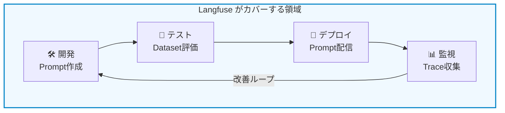
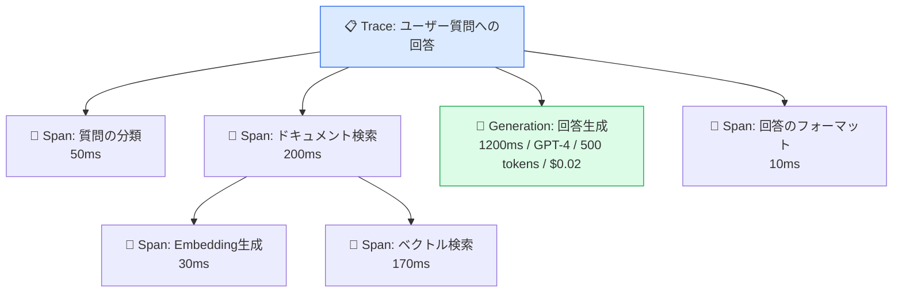
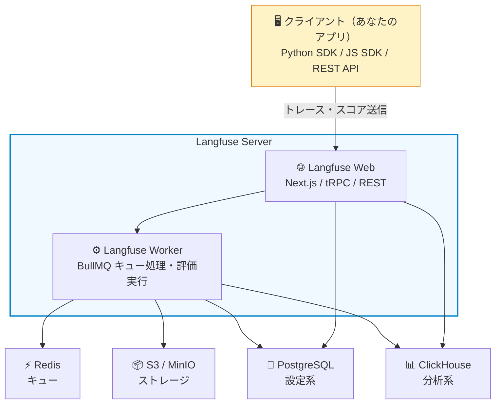

# モジュール 1-1: Langfuse概要

## 学習目標

- LLMOpsとは何か、なぜ必要なのかを理解する
- Langfuseがどのような課題を解決するかを説明できる
- Langfuseの主要機能の全体像を把握する

---

## 1. LLMOpsとは何か

### 従来のMLOpsとの違い

従来の機械学習（ML）では、モデルの学習・デプロイ・監視というパイプラインが確立されていました。
LLM（大規模言語モデル）を活用したアプリケーションでは、新たな課題が生まれます：

| 従来のMLOps | LLMOps |
|-------------|--------|
| モデルを自前で学習 | 外部APIのモデルを利用 |
| 入出力が構造化データ | 入出力が自然言語（非決定的） |
| 精度メトリクスが明確 | 品質評価が主観的・多次元的 |
| バッチ推論が中心 | リアルタイム対話が中心 |
| コストはインフラ固定費 | トークン従量課金 |

### LLMアプリケーション開発の課題

LLMアプリケーションを本番運用する際、以下の課題に直面します：

1. **可観測性の欠如** — LLMへの入出力、中間処理が見えない
2. **品質の不安定さ** — 同じプロンプトでも結果が異なる、品質劣化に気づけない
3. **コスト管理の困難** — トークン使用量が予測しづらい
4. **プロンプトの管理** — バージョン管理なしに本番プロンプトを変更してしまう
5. **評価の属人化** — 品質チェックが手動・散発的

---

## 2. Langfuseとは

Langfuseは、LLMアプリケーションのための**オープンソース LLMエンジニアリング基盤**です。

開発・監視・評価・改善のサイクルを一気通貫で支援します。

### ポジショニング

### 主な利用シーン

- **チャットボット** — 会話品質の監視、ユーザーフィードバック収集
- **RAG（検索拡張生成）** — 検索精度・生成品質の可視化
- **AIエージェント** — ツール呼び出しの追跡、エラー検出
- **コンテンツ生成** — 出力品質の自動評価、A/Bテスト

---

## 3. Langfuseの主要機能

### 3.1 Observability（可観測性）

LLMアプリケーションの内部動作を**トレース**として記録・可視化します。

**できること：**
- LLMへの入出力、レイテンシ、トークン数、コストの記録
- 複数ステップ（検索→生成→後処理）のネスト構造の可視化
- ユーザー・セッション単位での追跡
- エラーや異常の検出

**イメージ：**

### 3.2 Prompt Management（プロンプト管理）

プロンプトを**コードから分離**して中央管理します。

**できること：**
- バージョン管理（履歴の保持、ロールバック）
- 環境ラベル（production / staging / latest）
- SDKからのプロンプト取得（キャッシュ付き）
- プロンプト変更のトレースへの紐付け

### 3.3 Evaluation（評価）

LLMの出力品質を**体系的に評価**します。

**評価方法：**

| 方法 | 説明 | ユースケース |
|------|------|-------------|
| LLM-as-a-Judge | 別のLLMが品質を自動判定 | 大量トレースの自動評価 |
| ヒューマンアノテーション | 人手によるラベル付け | 高品質な評価データの作成 |
| ユーザーフィードバック | エンドユーザーの👍👎 | リアルタイムの品質シグナル |
| コード評価 | プログラムによる判定 | 形式チェック、正規表現マッチ |

### 3.4 Datasets & Experiments（データセットと実験）

テストセットを使って**体系的にプロンプト・モデルを比較**します。

**できること：**
- テストケース（入力 + 期待出力）の管理
- 異なるプロンプト/モデル設定での一括実行
- 結果の定量比較（スコア、コスト、レイテンシ）

### 3.5 その他の機能

| 機能 | 説明 |
|------|------|
| Playground | プロンプトの対話的テスト |
| Dashboards | カスタムメトリクスの可視化 |
| Monitors & Alerts | 異常検知とアラート通知 |
| Annotation Queues | チームでのアノテーションワークフロー |

---

## 4. Langfuseのアーキテクチャ概要

### デプロイオプション

| オプション | 特徴 |
|-----------|------|
| **Langfuse Cloud** | マネージドサービス、即座に開始可能 |
| **セルフホスト** | 完全なデータコントロール、Docker/Helm/Terraform対応 |

### 技術スタック（参考）

---

## 5. 競合ツールとの比較

| 特徴 | Langfuse | LangSmith | Weights & Biases | Arize AI |
|------|----------|-----------|------------------|----------|
| オープンソース | ✅ | ❌ | ❌ | ❌ |
| セルフホスト可 | ✅ | ❌ | ❌ | ❌ |
| プロンプト管理 | ✅ | ✅ | ❌ | ❌ |
| LLM評価 | ✅ | ✅ | ✅ | ✅ |
| データセット/実験 | ✅ | ✅ | ✅ | ✅ |
| フレームワーク非依存 | ✅ | △（LangChain中心） | ✅ | ✅ |
| 無料利用可能 | ✅ | △ | △ | △ |

Langfuseの最大の強みは：
1. **オープンソース** — コードを自由に閲覧・改変・セルフホスト可能
2. **フレームワーク非依存** — LangChain、LlamaIndex、素のOpenAI、何でも対応
3. **段階的導入** — 1行のコード追加から始められる

---

## 確認問題

1. LLMOpsが従来のMLOpsと異なる点を3つ挙げてください
2. Langfuseの4つの主要機能を説明してください
3. 「LLM-as-a-Judge」とはどのような評価手法ですか？
4. Langfuseをセルフホストする場合に必要なデータストアは何ですか？

---

## 次のステップ

[モジュール 1-2: 環境セットアップ](./1-2-setup.md) に進み、実際にLangfuseを使い始めましょう。
