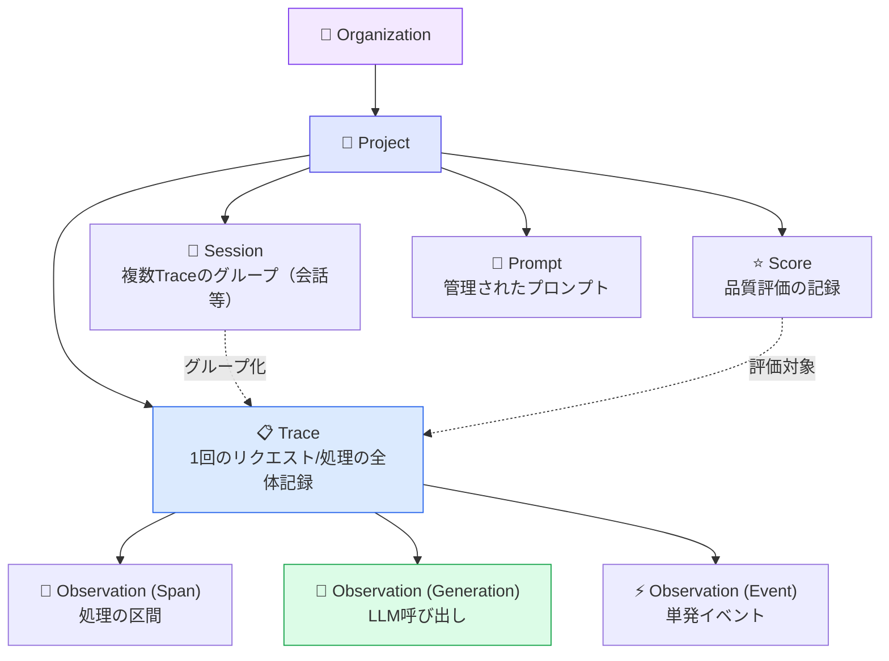
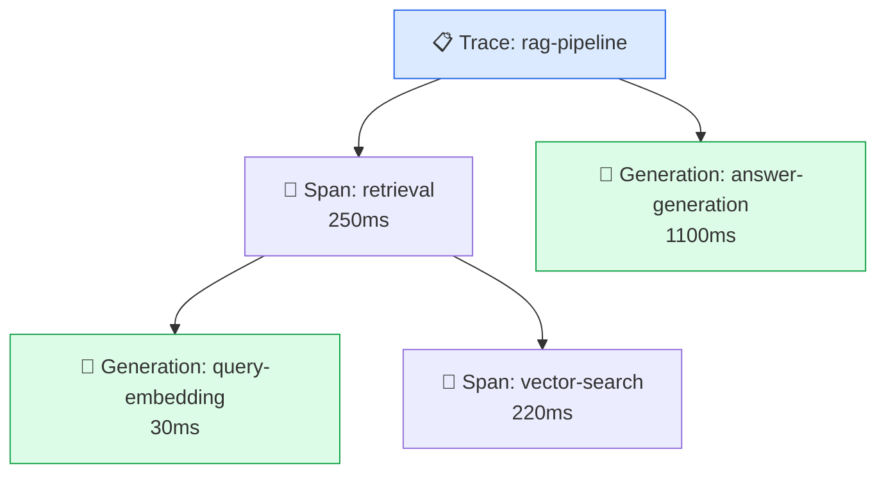
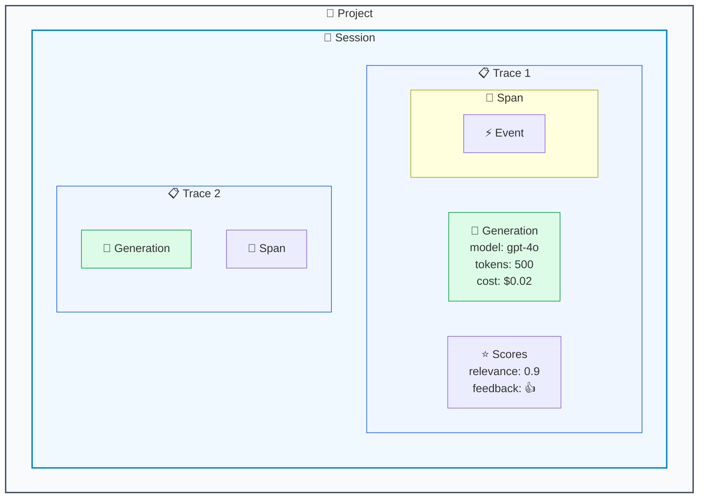

# モジュール 1-3: コアコンセプト

## 学習目標

- Langfuseのデータモデル（Trace / Observation / Session / Score）を理解する
- 各オブジェクトの関係性と階層構造を説明できる
- UIの基本操作（一覧、詳細、フィルタ、ダッシュボード）ができる

---

## 1. データモデル概要

Langfuseのデータモデルは、LLMアプリケーションの動作を階層的に記録するために設計されています。



---

## 2. Trace（トレース）

### 定義

Traceは、**1つのリクエストや処理全体**を表す最上位のオブジェクトです。
例えば「ユーザーが質問を送信してから回答が返るまで」が1つのTraceになります。

### 主要な属性

| 属性 | 説明 | 例 |
|------|------|-----|
| `id` | 一意な識別子 | 自動生成 or カスタム指定 |
| `name` | トレースの名前 | `"chat-response"`, `"document-qa"` |
| `input` | 入力データ | ユーザーの質問文 |
| `output` | 出力データ | 生成された回答 |
| `userId` | ユーザー識別子 | `"user-123"` |
| `sessionId` | セッション識別子 | `"session-abc"` |
| `metadata` | 任意のメタデータ | `{"version": "1.2", "env": "prod"}` |
| `tags` | タグ（フィルタ用） | `["production", "gpt-4"]` |
| `environment` | 実行環境 | `"production"`, `"development"` |

### コード例

```python
from langfuse import Langfuse, observe

langfuse = Langfuse()


@observe(name="customer-support-qa")
def handle_support_query(question: str) -> str:
    # この関数の実行が自動的にTraceとして記録される
    return f"回答: {question} に対するポリシー情報"


handle_support_query("返品ポリシーを教えてください")
langfuse.flush()
```

---

## 3. Observation（オブザベーション）

### 定義

Observationは、Trace内の**個々の処理ステップ**を表します。
3つのタイプがあります：

### 3.1 Generation（ジェネレーション）

**LLM呼び出し**を記録します。Langfuseで最も重要なObservationタイプです。

| 属性 | 説明 |
|------|------|
| `model` | 使用モデル名 |
| `input` | プロンプト / メッセージ |
| `output` | LLMの応答 |
| `usage` | トークン数（input / output / total） |
| `cost` | 推定コスト |
| `modelParameters` | temperature等のパラメータ |

```python
@observe(name="answer-generation", as_type="generation")
def generate_answer(question: str) -> str:
    # as_type="generation" でLLM呼び出しとして記録される
    # model, usage, cost 等は自動またはSDK経由で付与
    return "当社の返品ポリシーは..."
```

### 3.2 Span（スパン）

**時間のかかる処理区間**を記録します。開始と終了があります。

```python
@observe(name="document-retrieval")
def retrieve_documents(query: str) -> list[str]:
    # @observe で囲まれた関数の実行期間が自動的にSpanになる
    return ["doc-1", "doc-2", "doc-3"]
```

### 3.3 Event（イベント）

**瞬間的な出来事**を記録します。期間を持ちません。

```python
from langfuse import Langfuse

langfuse = Langfuse()
# イベントはスパン内で langfuse.event() として記録
```

### ネスト構造

Observationは**入れ子（ネスト）**にできます。
`@observe()` を付けた関数を別の `@observe()` 関数から呼ぶと自動的に親子関係になります。

```python
@observe(name="query-embedding", as_type="generation")
def embed_query(text: str) -> list[float]:
    return [0.1, 0.2, 0.3]  # 埋め込みベクトル


@observe(name="vector-search")
def search_vectors(embedding: list[float]) -> list[str]:
    return ["doc-1", "doc-2"]


@observe(name="retrieval")
def retrieve(query: str) -> list[str]:
    embedding = embed_query(query)  # 子Span
    results = search_vectors(embedding)  # 子Span
    return results


@observe(name="answer-generation", as_type="generation")
def generate(question: str, context: list[str]) -> str:
    return "回答..."


@observe(name="rag-pipeline")
def rag_pipeline(question: str) -> str:
    docs = retrieve(question)  # 子Span（さらにネスト）
    answer = generate(question, docs)  # 子Generation
    return answer
    input=[{"role": "user", "content": "..."}],
    output="回答テキスト",
)
```

これをUIで見ると：



---

## 4. Session（セッション）

### 定義

Sessionは、**複数のTraceをグループ化**する概念です。
典型的には「1回の会話（複数ターン）」を表します。

```python
from langfuse import Langfuse, observe

langfuse = Langfuse()


@observe(name="chat-turn")
def chat_turn(message: str) -> str:
    """各ターンが1つのTraceになる"""
    return f"回答: {message} への応答"


# 同じ session_id を使って複数ターンをグループ化
# （注: セッションIDの設定は langfuse.update_current_trace() で行う）
chat_turn("こんにちは")
chat_turn("天気を教えて")
langfuse.flush()
```

### UIでの表示

「Sessions」画面では：
- セッション一覧（トレース数、時間範囲）
- セッション内のトレースの時系列表示
- セッション全体のコスト・トークン集計

---

## 5. Score（スコア）

### 定義

Scoreは、Trace/Observation/Sessionに対する**品質評価**を記録します。

### スコアのタイプ

| タイプ | 値の形式 | 例 |
|--------|---------|-----|
| `NUMERIC` | 数値 | 0〜1の品質スコア |
| `CATEGORICAL` | カテゴリ | "good", "bad", "neutral" |
| `BOOLEAN` | 真偽値 | True / False |

### スコアのソース

| ソース | 説明 | 例 |
|--------|------|-----|
| `API` | プログラムから送信 | ユーザーの👍👎、自動メトリクス |
| `EVAL` | 自動評価（LLM-as-Judge等） | 品質スコアの自動算出 |
| `ANNOTATION` | 人手アノテーション | レビュアーの評価 |

### コード例

```python
# Traceにスコアを付与
langfuse.score(
    trace_id=trace.id,
    name="user-feedback",
    value=1,  # 👍
    data_type="BOOLEAN",
    comment="ユーザーが「役に立った」を選択",
)

# 数値スコア
langfuse.score(
    trace_id=trace.id,
    name="relevance",
    value=0.85,
    data_type="NUMERIC",
)

# カテゴリスコア
langfuse.score(
    trace_id=trace.id,
    name="toxicity",
    value="safe",
    data_type="CATEGORICAL",
)
```

---

## 6. 全体の関係図



---

## 7. UI操作ガイド

### 7.1 Traces（トレース一覧）

左メニュー「Tracing」から：

- **一覧表示**: 全トレースの時系列リスト
- **フィルタ**: 名前、タグ、ユーザーID、時間範囲、環境で絞り込み
- **ソート**: 時刻、レイテンシ、コストなどで並べ替え
- **詳細**: クリックでトレースの全容（Observation階層、入出力、コスト）を表示

### 7.2 Sessions（セッション一覧）

左メニュー「Sessions」から：

- セッション単位でTraceをグループ表示
- 会話の全体フローを時系列で確認
- セッションレベルのスコア確認

### 7.3 Dashboards（ダッシュボード）

プロジェクトのトップページ：

- トレース数の推移
- コストの推移
- モデル別の使用状況
- レイテンシ分布
- スコアの傾向

### 7.4 便利なフィルタの例

| 目的 | フィルタ条件 |
|------|-------------|
| 本番のエラーを見つける | environment = production, level = ERROR |
| 高コストのリクエスト | sort by cost DESC |
| 特定ユーザーの履歴 | userId = "user-123" |
| 特定の機能のみ | name = "document-qa" |
| 低品質の回答 | scores.relevance < 0.5 |

---

## 8. ハンズオン: 総合演習

以下のスクリプトを実行し、UIで各要素を確認しましょう。

```python
"""Level 1 総合演習: 会話ボットのトレース"""
from langfuse import Langfuse, observe
import time

langfuse = Langfuse()


@observe(name="knowledge-search")
def search_knowledge(query: str) -> list[str]:
    """検索フェーズ（Spanとして記録）"""
    time.sleep(0.1)
    knowledge = {
        "観光": ["浅草寺", "東京タワー", "渋谷スクランブル"],
        "アクセス": ["東京メトロ銀座線 浅草駅から徒歩5分"],
    }
    for key, values in knowledge.items():
        if key in query:
            return values
    return ["情報なし"]


@observe(name="response-generation", as_type="generation")
def generate_response(question: str, context: list[str]) -> str:
    """生成フェーズ（Generationとして記録）"""
    return f"おすすめは: {', '.join(context)} です。"


@observe(name="chat-turn")
def chat_turn(message: str) -> str:
    """1ターンの会話（ネストされたSpan/Generationを含むTrace）"""
    results = search_knowledge(message)
    response = generate_response(message, results)
    return response


# === 実行 ===
print("ターン1:")
r1 = chat_turn("東京の観光スポットを教えて")
print(f"  🤖 {r1}")

print("ターン2:")
r2 = chat_turn("浅草寺へのアクセス方法は？")
print(f"  🤖 {r2}")

langfuse.flush()

print("\n✅ トレースを送信しました")
print("Langfuse UIで以下を確認してください:")
print("  1. Tracing画面 → 2つのトレースの詳細")
print("  2. Trace詳細 → Observation の階層構造（search → generation）")
```

---

## 確認問題

1. Trace と Observation の関係を説明してください
2. Generation / Span / Event の違いは何ですか？
3. Session はどのように作成されますか？（明示的に作成する？）
4. Score のソースにはどのような種類がありますか？
5. 高コストなトレースをUIで見つけるには、どのようなフィルタを使いますか？

---

## Level 1 修了チェックリスト

以下がすべて達成できていれば、Level 1は修了です：

- [ ] LLMOpsの必要性を説明できる
- [ ] Langfuseの4つの主要機能を挙げられる
- [ ] 環境をセットアップしAPIキーを取得した
- [ ] 最初のトレースを送信しUIで確認した
- [ ] Trace / Generation / Span / Event / Session / Score の関係を図示できる
- [ ] UIでフィルタを使ってトレースを検索できる

---

## 次のレベルへ

おめでとうございます！Level 1を修了しました。

[Level 2: 実践入門](../level-2/) では、Python/JS SDKを使った本格的なトレーシングを学びます。
`@observe()` デコレータ、OpenAIドロップインラッパー、フレームワーク統合など、
実際の開発で使うパターンを習得します。
