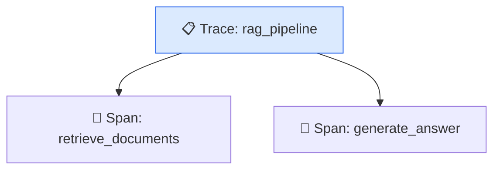
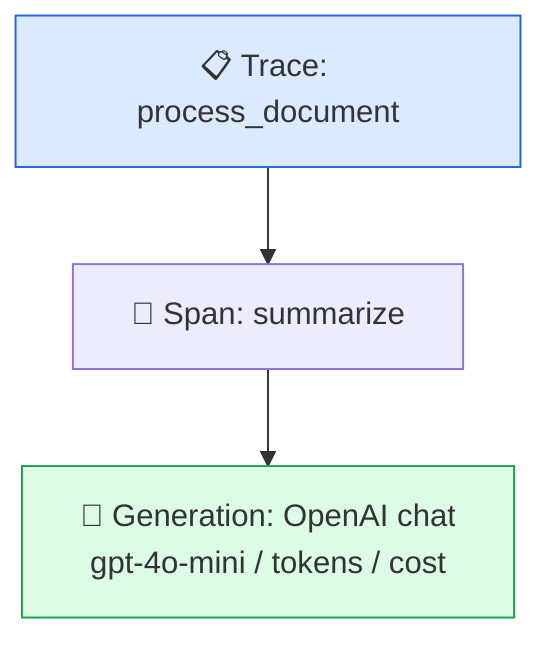

# モジュール 2-1: Python SDK入門

## 学習目標

- `@observe()` デコレータで関数を自動計装できる
- OpenAIドロップインラッパーを使いこなせる
- 手動でSpan/Generationを作成・管理できる
- ネストしたトレース構造を構築できる
- メタデータ・スコアを付与できる

---

## 1. Python SDKの概要

### インストール

```bash
pip install langfuse openai
```

### 初期化方法

```python
from langfuse import Langfuse

# 方法1: 環境変数から自動取得（推奨）
# LANGFUSE_PUBLIC_KEY, LANGFUSE_SECRET_KEY, LANGFUSE_HOST
langfuse = Langfuse()

# 方法2: 明示的に指定
langfuse = Langfuse(
    public_key="pk-...",
    secret_key="sk-...",
    host="https://cloud.langfuse.com",
)
```

### SDKの2つのアプローチ

| アプローチ | 特徴 | ユースケース |
|-----------|------|-------------|
| **デコレータ (`@observe`)** | 宣言的、最小限のコード変更 | 新規開発、関数ベースの設計 |
| **低レベルAPI** | 完全な制御、柔軟性 | 既存コードへの組み込み、複雑なフロー |

---

## 2. `@observe()` デコレータ

### 基本的な使い方

`@observe()` を付けた関数は、呼び出し時に自動的にSpanとして記録されます。

```python
from langfuse import observe, Langfuse

@observe()
def retrieve_documents(query: str) -> list[str]:
    """ドキュメント検索（自動的にSpanとして記録される）"""
    # 実際の検索処理
    results = vector_db.search(query, top_k=5)
    return results

@observe()
def generate_answer(question: str, context: list[str]) -> str:
    """回答生成（自動的にSpanとして記録される）"""
    prompt = f"Context: {context}\nQuestion: {question}"
    response = openai.chat.completions.create(
        model="gpt-4o-mini",
        messages=[{"role": "user", "content": prompt}],
    )
    return response.choices[0].message.content

@observe()
def rag_pipeline(question: str) -> str:
    """RAGパイプライン（最上位のTraceとして記録される）"""
    docs = retrieve_documents(question)
    answer = generate_answer(question, docs)
    return answer
```

### 自動ネスト

`@observe()` 関数内で別の `@observe()` 関数を呼ぶと、自動的に親子関係が作られます。



### コンテキストへのメタデータ追加

```python
from langfuse import observe, Langfuse

@observe()
def process_request(user_input: str) -> str:
    # 現在のトレース/スパンにメタデータを追加
    langfuse.update_current_observation(
        metadata={"input_length": len(user_input)},
    )

    # 現在のトレースにユーザーID等を設定
    langfuse.update_current_trace(
        user_id="user-123",
        session_id="session-456",
        tags=["production"],
    )

    result = do_something(user_input)
    return result
```

### Generation としてマーク

LLM呼び出しを含む関数は `as_type="generation"` を指定すると、
Generation（モデル・トークン情報付き）として記録されます。

```python
@observe(as_type="generation")
def call_llm(messages: list[dict]) -> str:
    response = openai.chat.completions.create(
        model="gpt-4o-mini",
        messages=messages,
    )

    # Generation固有の情報を追加
    langfuse.update_current_observation(
        model="gpt-4o-mini",
        usage={
            "input": response.usage.prompt_tokens,
            "output": response.usage.completion_tokens,
        },
        model_parameters={"temperature": 0.7},
    )

    return response.choices[0].message.content
```

---

## 3. OpenAI ドロップインラッパー

### 概要

Langfuseの OpenAI ラッパーは、**コード変更なし**でOpenAI API呼び出しを自動計装します。

```python
# 変更前
from openai import OpenAI
client = OpenAI()

# 変更後（この1行だけ）
from openai import OpenAI
# もしくは
from openai import OpenAI
client = OpenAI()
```

### 基本的な使い方

```python
from openai import OpenAI

response = openai.chat.completions.create(
    model="gpt-4o-mini",
    messages=[
        {"role": "system", "content": "簡潔に回答してください。"},
        {"role": "user", "content": "Pythonの特徴を3つ挙げて"},
    ],
    temperature=0.7,
)

print(response.choices[0].message.content)
```

これだけで以下が自動記録されます：
- モデル名、パラメータ
- 入力メッセージ / 出力メッセージ
- トークン数（input / output / total）
- レイテンシ
- 推定コスト

### トレース情報の付与

```python
from openai import OpenAI

response = openai.chat.completions.create(
    model="gpt-4o-mini",
    messages=[{"role": "user", "content": "Hello"}],
    # Langfuse固有のパラメータ（OpenAI APIには送信されない）
    name="greeting-generation",
    trace_id="custom-trace-id",
    session_id="session-001",
    user_id="user-abc",
    tags=["production"],
    metadata={"feature": "greeting"},
)
```

### `@observe()` との組み合わせ

```python
from langfuse import observe
from openai import OpenAI

@observe()
def summarize(text: str) -> str:
    """@observe内でOpenAIラッパーを使うと、自動的に子Generationになる"""
    response = openai.chat.completions.create(
        model="gpt-4o-mini",
        messages=[
            {"role": "system", "content": "テキストを3行で要約してください。"},
            {"role": "user", "content": text},
        ],
    )
    return response.choices[0].message.content

@observe()
def process_document(doc: str) -> dict:
    summary = summarize(doc)
    return {"summary": summary, "original_length": len(doc)}
```



### ストリーミング対応

```python
from openai import OpenAI

stream = openai.chat.completions.create(
    model="gpt-4o-mini",
    messages=[{"role": "user", "content": "長い文章を書いて"}],
    stream=True,
    name="streaming-generation",
)

for chunk in stream:
    if chunk.choices[0].delta.content:
        print(chunk.choices[0].delta.content, end="")
# ストリーム完了時に自動的にトレースが記録される
```

---

## 4. 低レベルAPI（手動計装）

### トレースの手動作成

```python
from langfuse import Langfuse, observe

langfuse = Langfuse()


@observe(name="preprocessing")
def preprocess(raw_text: str) -> str:
    return raw_text.strip().lower()


@observe(name="llm-call", as_type="generation")
def call_llm(prompt: str) -> str:
    # 実際にはOpenAI等を呼び出す
    return "生成されたテキスト"


@observe(name="manual-pipeline")
def pipeline(text: str) -> str:
    cleaned = preprocess(text)
    result = call_llm(cleaned)
    return result


output = pipeline("  入力テキスト  ")

# スコアを追加
langfuse.score_current_trace(name="quality", value=0.92)
langfuse.flush()
```

### ネストしたSpan

```python
@observe(name="child-step-1")
def child_step_1() -> dict:
    return {"status": "done"}

child2 = parent.span(name="child-step-2")
child2.end(output={"status": "done"})

parent.end()
```

---

## 5. 非同期アプリケーション対応

### async/await との組み合わせ

```python
import asyncio
from langfuse import observe
from openai import AsyncOpenAI

client = AsyncOpenAI()

@observe()
async def async_generate(prompt: str) -> str:
    response = await client.chat.completions.create(
        model="gpt-4o-mini",
        messages=[{"role": "user", "content": prompt}],
    )
    return response.choices[0].message.content

@observe()
async def parallel_generation(prompts: list[str]) -> list[str]:
    """複数のLLM呼び出しを並列実行"""
    tasks = [async_generate(p) for p in prompts]
    results = await asyncio.gather(*tasks)
    return results

asyncio.run(parallel_generation(["質問1", "質問2", "質問3"]))
```

---

## 6. エラーハンドリング

### 例外の自動記録

`@observe()` デコレータは例外を自動的にキャッチし、トレースにエラー情報を記録します。

```python
@observe()
def risky_operation(data: str) -> str:
    if not data:
        raise ValueError("Empty input")
    return process(data)

# 例外が発生すると、トレースに level=ERROR が記録される
# 例外自体は再raiseされるので、呼び出し側で通常通りハンドリング可能
try:
    result = risky_operation("")
except ValueError:
    print("エラーが発生しましたが、Langfuseには記録済みです")
```

### 手動でのエラー記録

```python
@observe()
def safe_operation(data: str) -> str:
    try:
        result = external_api_call(data)
        return result
    except ExternalAPIError as e:
        langfuse.update_current_observation(
            level="ERROR",
            status_message=str(e),
            metadata={"error_code": e.code},
        )
        return "フォールバック応答"
```

---

## 7. 実践パターン集

### パターン1: RAGアプリケーション

```python
from langfuse import observe, Langfuse
from openai import OpenAI

@observe()
def embed_query(query: str) -> list[float]:
    response = openai.embeddings.create(
        model="text-embedding-3-small",
        input=query,
    )
    return response.data[0].embedding

@observe()
def search_documents(embedding: list[float], top_k: int = 5) -> list[dict]:
    results = vector_store.similarity_search(embedding, k=top_k)
    langfuse.update_current_observation(
        metadata={"num_results": len(results)},
    )
    return results

@observe(as_type="generation")
def generate_answer(question: str, context: str) -> str:
    response = openai.chat.completions.create(
        model="gpt-4o",
        messages=[
            {"role": "system", "content": f"以下のコンテキストに基づいて回答:\n{context}"},
            {"role": "user", "content": question},
        ],
    )
    return response.choices[0].message.content

@observe()
def rag_query(question: str) -> str:
    langfuse.update_current_trace(
        user_id="user-123",
        tags=["rag", "production"],
    )

    embedding = embed_query(question)
    docs = search_documents(embedding)
    context = "\n".join(d["content"] for d in docs)
    answer = generate_answer(question, context)
    return answer
```

### パターン2: マルチステップエージェント

```python
@observe()
def agent_loop(user_input: str, max_iterations: int = 5) -> str:
    langfuse.update_current_trace(
        metadata={"max_iterations": max_iterations},
    )

    messages = [{"role": "user", "content": user_input}]

    for i in range(max_iterations):
        response = call_llm_with_tools(messages)

        if response.finish_reason == "stop":
            return response.content

        # ツール呼び出しの実行
        tool_result = execute_tool(response.tool_calls[0])
        messages.append({"role": "tool", "content": tool_result})

    return "最大反復回数に達しました"

@observe()
def execute_tool(tool_call) -> str:
    langfuse.update_current_observation(
        metadata={"tool_name": tool_call.function.name},
    )
    # ツール実行ロジック
    ...
```

### パターン3: ユーザーフィードバック収集

```python
from langfuse import Langfuse

langfuse = Langfuse()

@observe()
def chat_endpoint(user_message: str) -> dict:
    trace = langfuse.get_current_trace()
    response = generate_response(user_message)
    return {
        "response": response,
        "trace_id": trace.id,  # フロントエンドに返す
    }

def submit_feedback(trace_id: str, score: int, comment: str = ""):
    """フロントエンドからのフィードバックを記録"""
    langfuse.score(
        trace_id=trace_id,
        name="user-feedback",
        value=score,
        comment=comment,
    )
```

---

## 8. デバッグとベストプラクティス

### デバッグモード

```python
import logging
logging.basicConfig(level=logging.DEBUG)

# Langfuseのログを有効化
langfuse = Langfuse(debug=True)
```

### flush のタイミング

```python
# SDKはバックグラウンドで非同期送信する
# 以下の場合にflush()を明示的に呼ぶ：

# 1. スクリプトの終了時
langfuse.flush()

# 2. Webサーバのシャットダウン時
@app.on_event("shutdown")
def shutdown():
    langfuse.flush()

# 3. @observe()使用時はatexit hookで自動flush（通常は不要）
```

### ベストプラクティス

| 項目 | 推奨 |
|------|------|
| 命名規則 | `kebab-case` で一貫させる（`"document-retrieval"`） |
| メタデータ | 環境・バージョン・機能フラグを含める |
| ユーザーID | 常に設定する（分析に必須） |
| セッションID | 会話型アプリでは必須 |
| タグ | 環境（prod/dev）、機能名を付ける |
| エラー | try/catch内でもlevel="ERROR"を記録 |
| コスト | カスタムモデルでは手動で設定 |

---

## 確認問題

1. `@observe()` と `@observe(as_type="generation")` の違いは何ですか？
2. OpenAIドロップインラッパーを使うために必要なコード変更は何行ですか？
3. `langfuse.update_current_trace()` と `update_current_observation()` の違いは？
4. ストリーミングレスポンスの場合、トレースはいつ記録されますか？
5. 非同期アプリケーションで `@observe()` を使う際の注意点は？

---

## ハンズオン課題

1. 既存のPythonスクリプト（OpenAI APIを使うもの）に `@observe()` を追加し、UIでトレースを確認
2. RAGパイプライン（検索→生成）を実装し、各ステップがネストされることを確認
3. エラーが発生するケースを意図的に作り、UIでエラートレースを確認

---

## 次のステップ

[モジュール 2-2: JS/TS SDK入門](./2-2-js-ts-sdk.md) に進みましょう。
