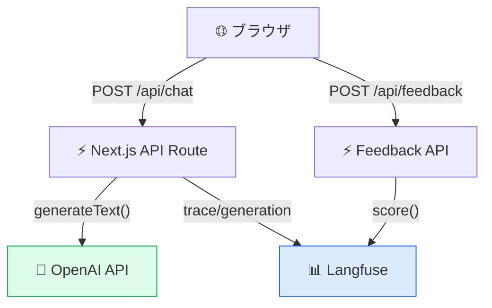

# モジュール 2-2: JS/TS SDK入門

## 学習目標

- Langfuse JS/TS SDKをセットアップできる
- Vercel AI SDKとの統合ができる
- Next.jsアプリケーションにLangfuseを組み込める
- サーバーサイド/エッジランタイムでの計装ができる

---

## 1. SDKのインストールと初期化

### インストール

```bash
npm install langfuse
# Vercel AI SDK との統合
npm install ai @ai-sdk/openai
```

### 初期化

```typescript
import { Langfuse } from "langfuse";

// 環境変数から自動取得
// LANGFUSE_PUBLIC_KEY, LANGFUSE_SECRET_KEY, LANGFUSE_BASEURL
const langfuse = new Langfuse();

// 明示的に指定
const langfuse = new Langfuse({
  publicKey: "pk-...",
  secretKey: "sk-...",
  baseUrl: "https://cloud.langfuse.com",
});
```

---

## 2. 基本的なトレーシング

### トレースの作成

```typescript
import { Langfuse } from "langfuse";

const langfuse = new Langfuse();

async function handleRequest(userMessage: string) {
  const trace = langfuse.trace({
    name: "chat-request",
    userId: "user-123",
    sessionId: "session-456",
    input: { message: userMessage },
    tags: ["production"],
  });

  // Span: 前処理
  const preprocessSpan = trace.span({
    name: "preprocessing",
    input: { rawInput: userMessage },
  });
  const cleanedInput = preprocess(userMessage);
  preprocessSpan.end({ output: { cleanedInput } });

  // Generation: LLM呼び出し
  const generation = trace.generation({
    name: "llm-response",
    model: "gpt-4o-mini",
    input: [{ role: "user", content: cleanedInput }],
    modelParameters: { temperature: 0.7 },
  });

  const response = await callLLM(cleanedInput);

  generation.end({
    output: response.text,
    usage: {
      input: response.promptTokens,
      output: response.completionTokens,
    },
  });

  trace.update({ output: { response: response.text } });
  await langfuse.flushAsync();

  return response.text;
}
```

---

## 3. Vercel AI SDK 統合

### 基本的な統合

```typescript
import { generateText, streamText } from "ai";
import { openai } from "@ai-sdk/openai";
import { Langfuse } from "langfuse";

const langfuse = new Langfuse();

async function chat(userMessage: string) {
  const trace = langfuse.trace({
    name: "ai-sdk-chat",
    input: { message: userMessage },
  });

  const generation = trace.generation({
    name: "generate-response",
    model: "gpt-4o-mini",
    input: [{ role: "user", content: userMessage }],
  });

  const { text, usage } = await generateText({
    model: openai("gpt-4o-mini"),
    messages: [{ role: "user", content: userMessage }],
  });

  generation.end({
    output: text,
    usage: {
      input: usage.promptTokens,
      output: usage.completionTokens,
    },
  });

  await langfuse.flushAsync();
  return text;
}
```

### ストリーミング対応

```typescript
import { streamText } from "ai";
import { openai } from "@ai-sdk/openai";

async function streamChat(userMessage: string) {
  const trace = langfuse.trace({
    name: "streaming-chat",
    input: { message: userMessage },
  });

  const generation = trace.generation({
    name: "stream-generation",
    model: "gpt-4o-mini",
    input: [{ role: "user", content: userMessage }],
  });

  const result = streamText({
    model: openai("gpt-4o-mini"),
    messages: [{ role: "user", content: userMessage }],
    onFinish: async ({ text, usage }) => {
      generation.end({
        output: text,
        usage: {
          input: usage.promptTokens,
          output: usage.completionTokens,
        },
      });
      trace.update({ output: { response: text } });
      await langfuse.flushAsync();
    },
  });

  return result.toDataStreamResponse();
}
```

---

## 4. Next.js アプリケーションでの統合

### API Route (App Router)

```typescript
// app/api/chat/route.ts
import { NextRequest, NextResponse } from "next/server";
import { Langfuse } from "langfuse";
import { generateText } from "ai";
import { openai } from "@ai-sdk/openai";

const langfuse = new Langfuse();

export async function POST(req: NextRequest) {
  const { message, sessionId } = await req.json();

  const trace = langfuse.trace({
    name: "chat-api",
    sessionId,
    input: { message },
  });

  try {
    const generation = trace.generation({
      name: "chat-completion",
      model: "gpt-4o-mini",
      input: [{ role: "user", content: message }],
    });

    const { text, usage } = await generateText({
      model: openai("gpt-4o-mini"),
      messages: [{ role: "user", content: message }],
    });

    generation.end({
      output: text,
      usage: { input: usage.promptTokens, output: usage.completionTokens },
    });

    trace.update({ output: { response: text } });

    return NextResponse.json({
      response: text,
      traceId: trace.id,
    });
  } catch (error) {
    trace.update({
      metadata: { error: String(error) },
      tags: ["error"],
    });
    throw error;
  } finally {
    await langfuse.flushAsync();
  }
}
```

### フィードバック用エンドポイント

```typescript
// app/api/feedback/route.ts
import { NextRequest, NextResponse } from "next/server";
import { Langfuse } from "langfuse";

const langfuse = new Langfuse();

export async function POST(req: NextRequest) {
  const { traceId, score, comment } = await req.json();

  langfuse.score({
    traceId,
    name: "user-feedback",
    value: score,
    comment,
  });

  await langfuse.flushAsync();
  return NextResponse.json({ success: true });
}
```

### アーキテクチャ



---

## 5. エッジランタイム対応

### Cloudflare Workers / Vercel Edge

```typescript
// Edge環境ではflushAsyncが重要
import { Langfuse } from "langfuse";

export const runtime = "edge";

export async function GET(req: Request) {
  const langfuse = new Langfuse({
    // Edge環境ではリクエストごとにインスタンス化を推奨
    flushAt: 1, // 即座に送信
  });

  const trace = langfuse.trace({ name: "edge-function" });
  // ... 処理 ...

  // Edge環境ではwaitUntilパターンを使用
  const response = new Response("OK");

  // waitUntilでバックグラウンド送信
  // (ExecutionContext経由)
  ctx.waitUntil(langfuse.flushAsync());

  return response;
}
```

---

## 6. TypeScript型安全なパターン

### ジェネリクスを活用した型付きラッパー

```typescript
import { Langfuse } from "langfuse";

const langfuse = new Langfuse();

interface ChatInput {
  message: string;
  userId: string;
  sessionId: string;
}

interface ChatOutput {
  response: string;
  tokensUsed: number;
}

async function tracedChat(input: ChatInput): Promise<ChatOutput> {
  const trace = langfuse.trace({
    name: "typed-chat",
    userId: input.userId,
    sessionId: input.sessionId,
    input: { message: input.message },
  });

  const generation = trace.generation({
    name: "completion",
    model: "gpt-4o-mini",
    input: [{ role: "user", content: input.message }],
  });

  // ... LLM呼び出し ...

  const output: ChatOutput = {
    response: result.text,
    tokensUsed: result.usage.totalTokens,
  };

  generation.end({ output: output.response, usage: result.usage });
  trace.update({ output });

  return output;
}
```

---

## 7. シャットダウンとライフサイクル管理

```typescript
// Express / Fastify
process.on("SIGTERM", async () => {
  await langfuse.shutdownAsync();
  process.exit(0);
});

// Next.js (instrumentation.ts)
export async function register() {
  // サーバー起動時の初期化
}

// Serverless (各リクエスト後)
export async function handler(event: any) {
  // ... 処理 ...
  await langfuse.flushAsync();
}
```

---

## 確認問題

1. JS/TS SDKで`flushAsync()`はいつ呼ぶべきですか？
2. Vercel AI SDKのストリーミングでトレースを記録するには、どのコールバックを使いますか？
3. Edge Runtimeで注意すべきLangfuseの設定は何ですか？
4. フロントエンドからユーザーフィードバックを送る仕組みを説明してください

---

## 次のステップ

[モジュール 2-3: フレームワーク統合](./2-3-framework-integrations.md) に進みましょう。
