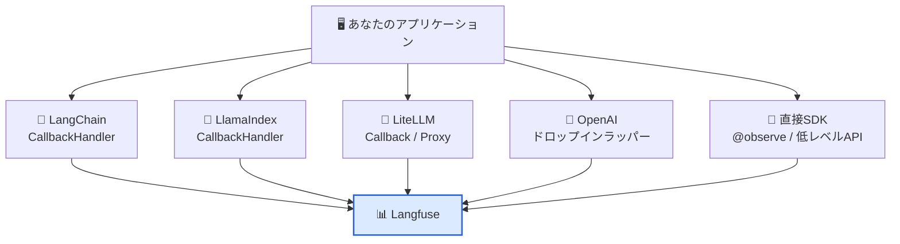
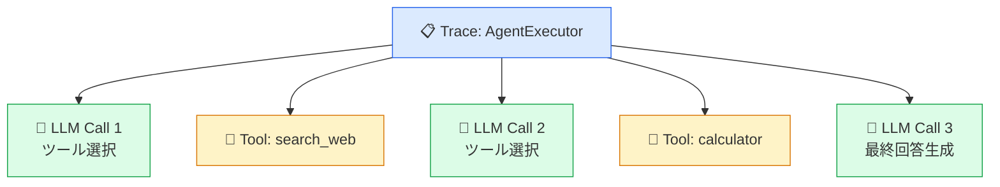
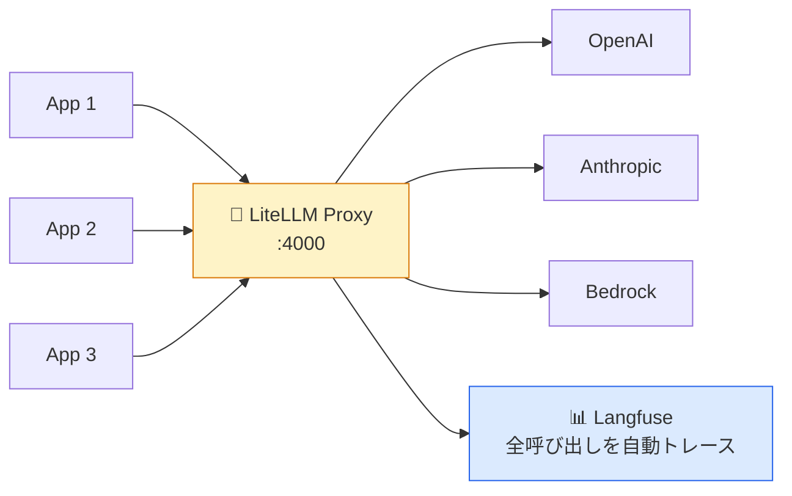

# モジュール 2-3: フレームワーク統合

## 学習目標

- LangChainとLangfuseを統合できる
- LlamaIndexとLangfuseを統合できる
- LiteLLMを介して複数モデルを統一的にトレースできる
- 各統合方法の特徴と使い分けを理解する

---

## 1. 統合方法の全体像



---

## 2. LangChain 統合

### インストール

```bash
pip install langfuse langchain langchain-openai
```

### CallbackHandler方式

```python
from langfuse.callback import CallbackHandler
from langchain_openai import ChatOpenAI
from langchain_core.prompts import ChatPromptTemplate
from langchain_core.output_parsers import StrOutputParser

# Langfuse CallbackHandler を作成
langfuse_handler = CallbackHandler(
    user_id="user-123",
    session_id="session-456",
    tags=["langchain", "production"],
)

# LangChain のチェーン構築
prompt = ChatPromptTemplate.from_messages([
    ("system", "あなたは{role}です。簡潔に回答してください。"),
    ("user", "{question}"),
])

chain = prompt | ChatOpenAI(model="gpt-4o-mini") | StrOutputParser()

# 実行時にCallbackHandlerを渡す
result = chain.invoke(
    {"role": "料理アドバイザー", "question": "簡単なパスタのレシピを教えて"},
    config={"callbacks": [langfuse_handler]},
)

print(result)
```

### LCEL チェーンの自動計装

```python
from langfuse.callback import CallbackHandler
from langchain_openai import ChatOpenAI, OpenAIEmbeddings
from langchain_core.prompts import ChatPromptTemplate
from langchain_core.runnables import RunnablePassthrough
from langchain_community.vectorstores import FAISS

langfuse_handler = CallbackHandler()

# RAG チェーン
retriever = FAISS.from_texts(
    ["Langfuseはオープンソースです", "LLMOpsツールです"],
    OpenAIEmbeddings(),
).as_retriever()

rag_chain = (
    {"context": retriever, "question": RunnablePassthrough()}
    | ChatPromptTemplate.from_template(
        "コンテキスト: {context}\n\n質問: {question}"
    )
    | ChatOpenAI(model="gpt-4o-mini")
    | StrOutputParser()
)

result = rag_chain.invoke(
    "Langfuseとは？",
    config={"callbacks": [langfuse_handler]},
)
```

### LangChain Agent のトレース

```python
from langchain.agents import create_tool_calling_agent, AgentExecutor
from langchain_openai import ChatOpenAI
from langchain_core.tools import tool

@tool
def search_web(query: str) -> str:
    """ウェブ検索を行う"""
    return f"検索結果: {query}に関する情報..."

@tool
def calculator(expression: str) -> str:
    """数学の計算を行う"""
    return str(eval(expression))

llm = ChatOpenAI(model="gpt-4o-mini")
tools = [search_web, calculator]
agent = create_tool_calling_agent(llm, tools, prompt)
executor = AgentExecutor(agent=agent, tools=tools)

result = executor.invoke(
    {"input": "東京の人口は何人？その10%は？"},
    config={"callbacks": [langfuse_handler]},
)
```



---

## 3. LlamaIndex 統合

### インストール

```bash
pip install langfuse llama-index llama-index-callbacks-langfuse
```

### 基本的な統合

```python
from llama_index.core import Settings, VectorStoreIndex, SimpleDirectoryReader
from llama_index.core.callbacks import CallbackManager
from langfuse.llama_index import LlamaIndexCallbackHandler

# Langfuse CallbackHandler
langfuse_callback = LlamaIndexCallbackHandler(
    user_id="user-123",
    session_id="session-456",
    tags=["llamaindex"],
)

# LlamaIndex の Settings に設定
Settings.callback_manager = CallbackManager([langfuse_callback])

# ドキュメントの読み込みとインデックス構築
documents = SimpleDirectoryReader("./data").load_data()
index = VectorStoreIndex.from_documents(documents)

# クエリ実行（自動的にトレースされる）
query_engine = index.as_query_engine()
response = query_engine.query("Langfuseの主な機能は？")

print(response)
langfuse_callback.flush()
```

### トレース情報のカスタマイズ

```python
langfuse_callback.set_trace_params(
    name="document-qa",
    user_id="user-456",
    session_id="new-session",
    tags=["qa", "production"],
    metadata={"index_type": "vector", "num_docs": len(documents)},
)

response = query_engine.query("次の質問...")
```

---

## 4. LiteLLM 統合

### LiteLLMとは

LiteLLMは、100以上のLLMプロバイダーを統一的なインターフェースで呼び出すライブラリです。
Langfuseとの統合により、どのプロバイダーを使ってもトレースが記録されます。

### インストール

```bash
pip install langfuse litellm
```

### Callback方式

```python
import litellm
from langfuse.litellm import LangfuseLiteLLMCallbackHandler

# コールバック登録
litellm.callbacks = [LangfuseLiteLLMCallbackHandler()]

# OpenAI
response = litellm.completion(
    model="gpt-4o-mini",
    messages=[{"role": "user", "content": "Hello from OpenAI!"}],
    metadata={
        "langfuse_user_id": "user-123",
        "langfuse_session_id": "session-456",
        "langfuse_tags": ["litellm", "openai"],
    },
)

# Anthropic（同じインターフェース）
response = litellm.completion(
    model="claude-3-5-sonnet-20241022",
    messages=[{"role": "user", "content": "Hello from Anthropic!"}],
    metadata={
        "langfuse_user_id": "user-123",
        "langfuse_tags": ["litellm", "anthropic"],
    },
)

# AWS Bedrock
response = litellm.completion(
    model="bedrock/anthropic.claude-3-sonnet-20240229-v1:0",
    messages=[{"role": "user", "content": "Hello from Bedrock!"}],
)
```

### LiteLLM Proxy（チーム利用）

```yaml
# litellm_config.yaml
model_list:
  - model_name: gpt-4o-mini
    litellm_params:
      model: openai/gpt-4o-mini
      api_key: sk-...
  - model_name: claude-sonnet
    litellm_params:
      model: anthropic/claude-3-5-sonnet-20241022
      api_key: sk-ant-...

litellm_settings:
  callbacks: ["langfuse"]

environment_variables:
  LANGFUSE_PUBLIC_KEY: "pk-..."
  LANGFUSE_SECRET_KEY: "sk-..."
  LANGFUSE_HOST: "https://cloud.langfuse.com"
```

```bash
litellm --config litellm_config.yaml
```



---

## 5. その他のフレームワーク

### Haystack

```python
from haystack import Pipeline
from langfuse.haystack import LangfuseConnector

tracer = LangfuseConnector()
pipeline = Pipeline()
# ... コンポーネント追加 ...
pipeline.run({"query": "質問"}, include_outputs_from=[tracer])
```

### CrewAI

```python
from crewai import Agent, Task, Crew
from langfuse import observe

@observe()
def run_crew():
    researcher = Agent(
        role="リサーチャー",
        goal="最新情報を調査する",
        backstory="...",
    )
    task = Task(description="Langfuseについてリサーチしてください", agent=researcher)
    crew = Crew(agents=[researcher], tasks=[task])
    return crew.kickoff()
```

### Instructor (構造化出力)

```python
import instructor
from openai import OpenAI
from pydantic import BaseModel

client = instructor.from_openai(OpenAI())

class Recipe(BaseModel):
    name: str
    ingredients: list[str]
    steps: list[str]

recipe = client.chat.completions.create(
    model="gpt-4o-mini",
    response_model=Recipe,
    messages=[{"role": "user", "content": "簡単なカレーのレシピ"}],
)
# 自動的にLangfuseにトレースされる
```

---

## 6. 統合方法の選択ガイド

| フレームワーク | 統合方法 | 自動計装 | 推奨度 |
|--------------|---------|---------|--------|
| LangChain | CallbackHandler | チェーン全体 | ⭐⭐⭐ |
| LlamaIndex | CallbackHandler | クエリパイプライン全体 | ⭐⭐⭐ |
| LiteLLM | Callback / Proxy | LLM呼び出し | ⭐⭐⭐ |
| OpenAI直接 | ドロップインラッパー | LLM呼び出し | ⭐⭐⭐ |
| Vercel AI SDK | 手動 + trace/generation | 手動制御 | ⭐⭐ |
| その他 | `@observe()` | 関数単位 | ⭐⭐⭐ |

### 組み合わせのベストプラクティス

```python
from langfuse import observe
from langfuse.callback import CallbackHandler

@observe()
def my_application(user_input: str):
    """アプリ全体を@observeでラップ"""

    # 内部でLangChainを使う場合
    handler = CallbackHandler(
        trace_id=langfuse.get_current_trace().id,
    )
    chain_result = my_chain.invoke(
        {"input": user_input},
        config={"callbacks": [handler]},
    )

    return chain_result
```

---

## 確認問題

1. LangChainのCallbackHandlerは何を自動記録しますか？
2. LiteLLM Proxyを使うメリットは何ですか？
3. 複数のフレームワークを組み合わせる場合、トレースを統合するにはどうしますか？
4. LlamaIndexでtrace情報をカスタマイズする方法は？

---

## 次のステップ

[モジュール 2-4: OpenTelemetry統合](./2-4-opentelemetry.md) に進みましょう。
