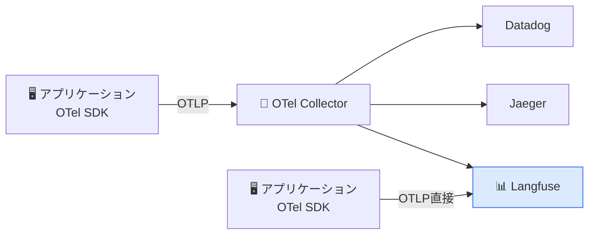
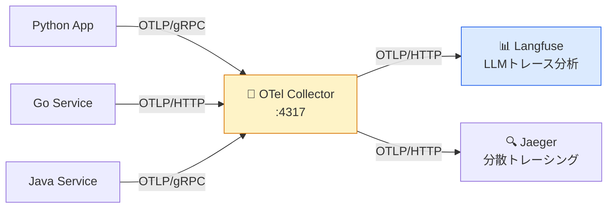
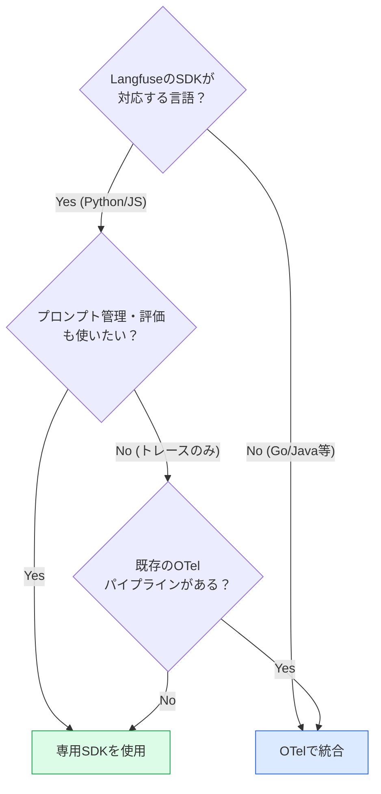

# モジュール 2-4: OpenTelemetry統合

## 学習目標

- OpenTelemetry（OTel）の基本概念を理解する
- LangfuseのOTelエンドポイントにトレースを送信できる
- 既存のOTelパイプラインとLangfuseを統合できる
- OTelベースの計装と専用SDKの使い分けを判断できる

---

## 1. OpenTelemetryとは

### 概要

OpenTelemetry（OTel）は、テレメトリデータ（トレース、メトリクス、ログ）の
計装・収集・エクスポートのための**ベンダー中立な標準規格**です。



### Langfuse + OTel のメリット

| メリット | 説明 |
|---------|------|
| ベンダーロックイン回避 | 標準プロトコルで複数バックエンドに送信可能 |
| 既存パイプライン活用 | 既にOTelを使っているチームは追加設定不要 |
| 言語非依存 | Go, Java, Rust 等、LangfuseのSDKがない言語でも利用可能 |
| 統合的な可観測性 | LLMトレースとインフラメトリクスを一元管理 |

---

## 2. LangfuseへのOTLPエクスポート

### 接続情報

Langfuseは OTLP/HTTP エンドポイントを公開しています。

```
エンドポイント: https://cloud.langfuse.com/api/public/otel
認証: Basic認証（public_key:secret_key）
プロトコル: OTLP/HTTP (protobuf or JSON)
```

### Python での設定

```bash
pip install opentelemetry-api opentelemetry-sdk opentelemetry-exporter-otlp
```

```python
import base64
from opentelemetry import trace
from opentelemetry.sdk.trace import TracerProvider
from opentelemetry.sdk.trace.export import BatchSpanProcessor
from opentelemetry.exporter.otlp.proto.http.trace_exporter import OTLPSpanExporter

# 認証ヘッダーの構築
public_key = "pk-..."
secret_key = "sk-..."
credentials = base64.b64encode(f"{public_key}:{secret_key}".encode()).decode()

# Exporter設定
exporter = OTLPSpanExporter(
    endpoint="https://cloud.langfuse.com/api/public/otel/v1/traces",
    headers={"Authorization": f"Basic {credentials}"},
)

# TracerProvider設定
provider = TracerProvider()
provider.add_span_processor(BatchSpanProcessor(exporter))
trace.set_tracer_provider(provider)

tracer = trace.get_tracer("my-llm-app")
```

### 環境変数での設定

```bash
export OTEL_EXPORTER_OTLP_ENDPOINT="https://cloud.langfuse.com/api/public/otel"
export OTEL_EXPORTER_OTLP_HEADERS="Authorization=Basic $(echo -n 'pk-...:sk-...' | base64)"
export OTEL_SERVICE_NAME="my-llm-app"
```

---

## 3. LLMトレースの送信

### LLM Semantic Conventions

OpenTelemetryにはLLM呼び出し向けのセマンティック規約があります。
Langfuseはこれらの属性を認識して、Generation として表示します。

```python
from opentelemetry import trace

tracer = trace.get_tracer("my-llm-app")

def call_llm(messages: list[dict]) -> str:
    with tracer.start_as_current_span(
        "chat-completion",
        attributes={
            # LLM Semantic Conventions
            "gen_ai.system": "openai",
            "gen_ai.request.model": "gpt-4o-mini",
            "gen_ai.request.temperature": 0.7,
            "gen_ai.request.max_tokens": 1000,
        },
    ) as span:
        response = openai_client.chat.completions.create(
            model="gpt-4o-mini",
            messages=messages,
            temperature=0.7,
        )

        # レスポンス属性を追加
        span.set_attribute("gen_ai.response.model", response.model)
        span.set_attribute("gen_ai.usage.input_tokens", response.usage.prompt_tokens)
        span.set_attribute("gen_ai.usage.output_tokens", response.usage.completion_tokens)
        span.set_attribute("gen_ai.response.finish_reasons", [response.choices[0].finish_reason])

        return response.choices[0].message.content
```

### Langfuse固有の属性

```python
with tracer.start_as_current_span("my-trace") as span:
    # Langfuseが認識する追加属性
    span.set_attribute("langfuse.trace.user_id", "user-123")
    span.set_attribute("langfuse.trace.session_id", "session-456")
    span.set_attribute("langfuse.trace.tags", ["production", "v2"])
    span.set_attribute("langfuse.trace.name", "rag-pipeline")

    # Span固有
    span.set_attribute("langfuse.span.input", '{"query": "..."}')
    span.set_attribute("langfuse.span.output", '{"result": "..."}')
```

---

## 4. OTel Collector経由の構成

### Collector設定例

```yaml
# otel-collector-config.yaml
receivers:
  otlp:
    protocols:
      http:
        endpoint: "0.0.0.0:4318"
      grpc:
        endpoint: "0.0.0.0:4317"

processors:
  batch:
    timeout: 5s
    send_batch_size: 256

exporters:
  otlphttp/langfuse:
    endpoint: "https://cloud.langfuse.com/api/public/otel"
    headers:
      Authorization: "Basic <base64(pk:sk)>"

  otlphttp/jaeger:
    endpoint: "http://jaeger:4318"

service:
  pipelines:
    traces:
      receivers: [otlp]
      processors: [batch]
      exporters: [otlphttp/langfuse, otlphttp/jaeger]
```



---

## 5. 自動計装ライブラリ

### OpenAI の自動計装

```bash
pip install opentelemetry-instrumentation-openai
```

```python
from opentelemetry.instrumentation.openai import OpenAIInstrumentor

# OpenAI呼び出しを自動計装
OpenAIInstrumentor().instrument()

# 以降のOpenAI呼び出しは自動的にSpanとして記録される
response = openai.chat.completions.create(
    model="gpt-4o-mini",
    messages=[{"role": "user", "content": "Hello"}],
)
```

### 複数の自動計装を組み合わせ

```python
from opentelemetry.instrumentation.openai import OpenAIInstrumentor
from opentelemetry.instrumentation.requests import RequestsInstrumentor
from opentelemetry.instrumentation.fastapi import FastAPIInstrumentor

# LLM呼び出し + HTTP + Web
OpenAIInstrumentor().instrument()
RequestsInstrumentor().instrument()
FastAPIInstrumentor.instrument_app(app)
```

---

## 6. 専用SDKとOTelの使い分け

| 観点 | 専用SDK (`langfuse`) | OpenTelemetry |
|------|---------------------|---------------|
| セットアップ | 簡単（1行で開始） | やや複雑 |
| 機能の豊富さ | Langfuse全機能 | トレースのみ |
| プロンプト管理 | ✅ 対応 | ❌ 別途SDKが必要 |
| データセット/評価 | ✅ 対応 | ❌ 別途SDKが必要 |
| スコア送信 | ✅ 対応 | ❌ 別途SDKが必要 |
| 言語対応 | Python, JS/TS | 全言語 |
| マルチバックエンド | Langfuseのみ | 複数に同時送信可能 |
| 既存OTel連携 | △ | ✅ ネイティブ |

### 推奨パターン



---

## 7. ハンズオン: OTelでLLMトレースを送信

```python
"""OTel + Langfuse のミニマム構成"""
import base64
import json

from opentelemetry import trace
from opentelemetry.sdk.trace import TracerProvider
from opentelemetry.sdk.trace.export import BatchSpanProcessor
from opentelemetry.exporter.otlp.proto.http.trace_exporter import OTLPSpanExporter
import openai

# --- OTel セットアップ ---
LANGFUSE_PUBLIC_KEY = "pk-..."
LANGFUSE_SECRET_KEY = "sk-..."
LANGFUSE_HOST = "https://cloud.langfuse.com"

credentials = base64.b64encode(
    f"{LANGFUSE_PUBLIC_KEY}:{LANGFUSE_SECRET_KEY}".encode()
).decode()

exporter = OTLPSpanExporter(
    endpoint=f"{LANGFUSE_HOST}/api/public/otel/v1/traces",
    headers={"Authorization": f"Basic {credentials}"},
)

provider = TracerProvider()
provider.add_span_processor(BatchSpanProcessor(exporter))
trace.set_tracer_provider(provider)

tracer = trace.get_tracer("otel-training")

# --- LLMアプリケーション ---
client = openai.OpenAI()


def rag_pipeline(question: str) -> str:
    with tracer.start_as_current_span(
        "rag-pipeline",
        attributes={
            "langfuse.trace.name": "otel-rag-demo",
            "langfuse.trace.user_id": "student-001",
            "langfuse.trace.tags": json.dumps(["training", "otel"]),
        },
    ) as root_span:
        root_span.set_attribute("langfuse.span.input", json.dumps({"question": question}))

        # 検索ステップ
        with tracer.start_as_current_span("document-search") as search_span:
            search_span.set_attribute("langfuse.span.input", json.dumps({"query": question}))
            context = "Langfuseはオープンソースの可観測性ツールです。"
            search_span.set_attribute("langfuse.span.output", json.dumps({"context": context}))

        # LLM呼び出し
        with tracer.start_as_current_span(
            "llm-generation",
            attributes={
                "gen_ai.system": "openai",
                "gen_ai.request.model": "gpt-4o-mini",
                "gen_ai.request.temperature": 0.7,
            },
        ) as gen_span:
            response = client.chat.completions.create(
                model="gpt-4o-mini",
                messages=[
                    {"role": "system", "content": f"コンテキスト: {context}"},
                    {"role": "user", "content": question},
                ],
            )
            answer = response.choices[0].message.content

            gen_span.set_attribute("gen_ai.usage.input_tokens", response.usage.prompt_tokens)
            gen_span.set_attribute("gen_ai.usage.output_tokens", response.usage.completion_tokens)
            gen_span.set_attribute("gen_ai.response.model", response.model)

        root_span.set_attribute("langfuse.span.output", json.dumps({"answer": answer}))
        return answer


result = rag_pipeline("Langfuseとは何ですか？")
print(f"回答: {result}")

# Spanのフラッシュ
provider.force_flush()
print("✅ OTelトレースをLangfuseに送信しました")
```

---

## 確認問題

1. OTelを使ってLangfuseにトレースを送信するために必要な認証情報は？
2. `gen_ai.request.model` 等のセマンティック規約属性の役割は？
3. OTel Collectorを使うメリットは何ですか？
4. 専用SDKではなくOTelを選択すべきケースはどのような場合ですか？

---

## Level 2 修了チェックリスト

- [ ] `@observe()` デコレータで自動計装ができる
- [ ] OpenAIドロップインラッパーでLLM呼び出しを記録できる
- [ ] JS/TS SDKでNext.jsアプリを計装できる
- [ ] LangChain/LlamaIndex/LiteLLMと統合できる
- [ ] OTelの基本概念と使い分けを理解している

---

## 次のレベルへ

[Level 3: 中級](../level-3/) では、プロンプト管理・評価・データセットを使った
品質改善ループを構築します。
