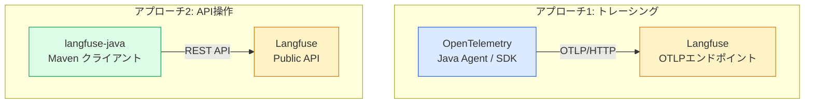
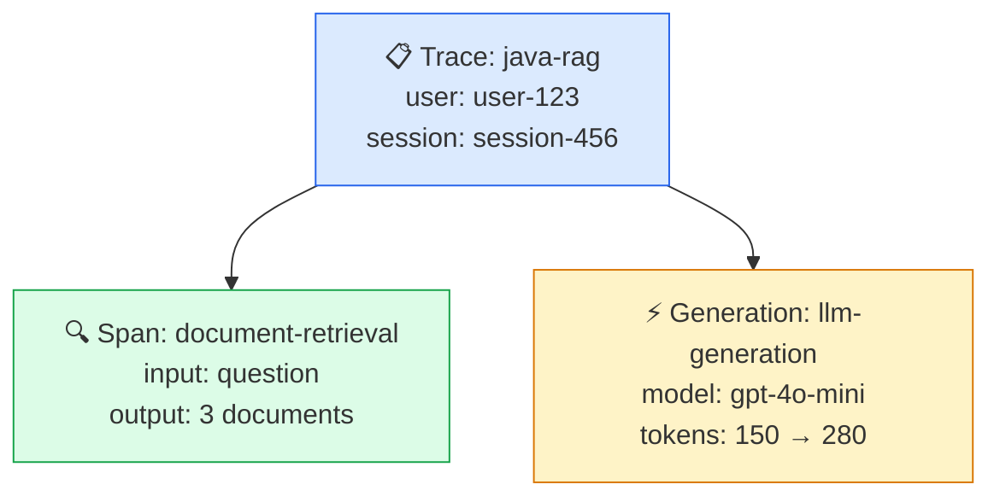

# モジュール 2-5: Java統合

## 学習目標

- Java アプリケーションに Langfuse トレーシングを組み込める
- OpenTelemetry Java Agent を使ったゼロコード計装を設定できる
- Spring Boot アプリケーションで LLM 呼び出しを計装できる
- langfuse-java クライアントでプロンプト取得・スコア送信ができる
- Java + Langfuse の実践的なアーキテクチャを設計できる

---

## 1. Java での Langfuse 利用アプローチ

Java では 2 つのアプローチを組み合わせて Langfuse を活用します。



| アプローチ | 用途 | 方法 |
|-----------|------|------|
| トレーシング | Trace / Span / Generation の記録 | OpenTelemetry Java Agent or SDK |
| API操作 | プロンプト取得、スコア送信、データセット管理 | `langfuse-java` Maven パッケージ |

---

## 2. OpenTelemetry Java Agent によるゼロコード計装

### 概要

OpenTelemetry Java Agent は JVM にアタッチするだけで、HTTP クライアント呼び出しや
フレームワーク処理を自動的にトレースとして記録します。

### セットアップ

**1. Java Agent のダウンロード**

```bash
curl -L -o opentelemetry-javaagent.jar \
  https://github.com/open-telemetry/opentelemetry-java-instrumentation/releases/latest/download/opentelemetry-javaagent.jar
```

**2. 環境変数の設定**

```bash
export OTEL_TRACES_EXPORTER=otlp
export OTEL_EXPORTER_OTLP_PROTOCOL=http/protobuf
export OTEL_EXPORTER_OTLP_ENDPOINT=http://localhost:3000/api/public/otel
export OTEL_EXPORTER_OTLP_HEADERS="Authorization=Basic $(echo -n 'pk-lf-...:sk-lf-...' | base64)"
export OTEL_SERVICE_NAME=my-java-llm-app
```

**3. アプリケーションの起動**

```bash
java -javaagent:opentelemetry-javaagent.jar -jar my-app.jar
```

これだけで、HTTP クライアント呼び出し（OkHttp, Apache HttpClient 等）が
自動的に Span として Langfuse に送信されます。

---

## 3. Spring Boot での手動計装

### 依存関係の追加

```xml
<dependencies>
    <!-- OpenTelemetry API -->
    <dependency>
        <groupId>io.opentelemetry</groupId>
        <artifactId>opentelemetry-api</artifactId>
        <version>1.41.0</version>
    </dependency>

    <!-- OpenTelemetry SDK -->
    <dependency>
        <groupId>io.opentelemetry</groupId>
        <artifactId>opentelemetry-sdk</artifactId>
        <version>1.41.0</version>
    </dependency>

    <!-- OTLP Exporter -->
    <dependency>
        <groupId>io.opentelemetry</groupId>
        <artifactId>opentelemetry-exporter-otlp</artifactId>
        <version>1.41.0</version>
    </dependency>

    <!-- Langfuse Java Client (API操作用) -->
    <dependency>
        <groupId>com.langfuse</groupId>
        <artifactId>langfuse-java</artifactId>
        <version>0.2.0</version>
    </dependency>
</dependencies>
```

### OTel 初期化の設定クラス

```java
import io.opentelemetry.api.OpenTelemetry;
import io.opentelemetry.api.trace.Tracer;
import io.opentelemetry.exporter.otlp.http.trace.OtlpHttpSpanExporter;
import io.opentelemetry.sdk.OpenTelemetrySdk;
import io.opentelemetry.sdk.trace.SdkTracerProvider;
import io.opentelemetry.sdk.trace.export.BatchSpanProcessor;
import org.springframework.context.annotation.Bean;
import org.springframework.context.annotation.Configuration;

import java.util.Base64;

@Configuration
public class LangfuseOtelConfig {

    private static final String LANGFUSE_HOST = "http://localhost:3000";
    private static final String PUBLIC_KEY = "pk-lf-...";
    private static final String SECRET_KEY = "sk-lf-...";

    @Bean
    public OpenTelemetry openTelemetry() {
        String credentials = Base64.getEncoder().encodeToString(
            (PUBLIC_KEY + ":" + SECRET_KEY).getBytes()
        );

        OtlpHttpSpanExporter exporter = OtlpHttpSpanExporter.builder()
            .setEndpoint(LANGFUSE_HOST + "/api/public/otel/v1/traces")
            .addHeader("Authorization", "Basic " + credentials)
            .build();

        SdkTracerProvider tracerProvider = SdkTracerProvider.builder()
            .addSpanProcessor(BatchSpanProcessor.builder(exporter).build())
            .build();

        return OpenTelemetrySdk.builder()
            .setTracerProvider(tracerProvider)
            .buildAndRegisterGlobal();
    }

    @Bean
    public Tracer tracer(OpenTelemetry openTelemetry) {
        return openTelemetry.getTracer("langfuse-java-app");
    }
}
```

### LLM 呼び出しの計装

```java
import io.opentelemetry.api.trace.Span;
import io.opentelemetry.api.trace.Tracer;
import io.opentelemetry.context.Scope;
import org.springframework.stereotype.Service;

@Service
public class LlmService {

    private final Tracer tracer;
    private final OpenAiClient openAiClient;

    public LlmService(Tracer tracer, OpenAiClient openAiClient) {
        this.tracer = tracer;
        this.openAiClient = openAiClient;
    }

    public String chat(String userMessage) {
        // ルートSpan（= Langfuse上のTrace）
        Span rootSpan = tracer.spanBuilder("chat-request")
            .setAttribute("langfuse.trace.name", "java-chat")
            .setAttribute("langfuse.trace.user_id", "user-123")
            .startSpan();

        try (Scope scope = rootSpan.makeCurrent()) {
            rootSpan.setAttribute("langfuse.span.input",
                "{\"message\": \"" + userMessage + "\"}");

            // LLM呼び出しSpan（= Langfuse上のGeneration）
            Span llmSpan = tracer.spanBuilder("openai-chat-completion")
                .setAttribute("gen_ai.system", "openai")
                .setAttribute("gen_ai.request.model", "gpt-4o-mini")
                .setAttribute("gen_ai.request.temperature", 0.7)
                .startSpan();

            String answer;
            try (Scope llmScope = llmSpan.makeCurrent()) {
                ChatResponse response = openAiClient.chatCompletion(userMessage);
                answer = response.getContent();

                llmSpan.setAttribute("gen_ai.response.model", response.getModel());
                llmSpan.setAttribute("gen_ai.usage.input_tokens",
                    response.getUsage().getPromptTokens());
                llmSpan.setAttribute("gen_ai.usage.output_tokens",
                    response.getUsage().getCompletionTokens());
            } finally {
                llmSpan.end();
            }

            rootSpan.setAttribute("langfuse.span.output",
                "{\"answer\": \"" + answer + "\"}");
            return answer;
        } finally {
            rootSpan.end();
        }
    }
}
```

### RAGパイプラインの完全な例

```java
@Service
public class RagService {

    private final Tracer tracer;
    private final VectorStore vectorStore;
    private final OpenAiClient openAiClient;

    public RagService(Tracer tracer, VectorStore vectorStore, OpenAiClient openAiClient) {
        this.tracer = tracer;
        this.vectorStore = vectorStore;
        this.openAiClient = openAiClient;
    }

    public String answer(String question, String sessionId) {
        Span traceSpan = tracer.spanBuilder("rag-pipeline")
            .setAttribute("langfuse.trace.name", "java-rag")
            .setAttribute("langfuse.trace.session_id", sessionId)
            .setAttribute("langfuse.trace.tags", "[\"java\", \"rag\"]")
            .startSpan();

        try (Scope traceScope = traceSpan.makeCurrent()) {
            traceSpan.setAttribute("langfuse.span.input",
                "{\"question\": \"" + question + "\"}");

            // 1. 文書検索
            String context = retrieveDocuments(question);

            // 2. LLM生成
            String result = generateAnswer(question, context);

            traceSpan.setAttribute("langfuse.span.output",
                "{\"answer\": \"" + result + "\"}");
            return result;
        } finally {
            traceSpan.end();
        }
    }

    private String retrieveDocuments(String query) {
        Span span = tracer.spanBuilder("document-retrieval")
            .startSpan();
        try (Scope scope = span.makeCurrent()) {
            span.setAttribute("langfuse.span.input",
                "{\"query\": \"" + query + "\"}");

            List<Document> docs = vectorStore.search(query, 3);
            String context = docs.stream()
                .map(Document::getContent)
                .collect(Collectors.joining("\n"));

            span.setAttribute("langfuse.span.output",
                "{\"num_docs\": " + docs.size() + "}");
            return context;
        } finally {
            span.end();
        }
    }

    private String generateAnswer(String question, String context) {
        Span span = tracer.spanBuilder("llm-generation")
            .setAttribute("gen_ai.system", "openai")
            .setAttribute("gen_ai.request.model", "gpt-4o-mini")
            .setAttribute("gen_ai.request.temperature", 0.3)
            .startSpan();

        try (Scope scope = span.makeCurrent()) {
            String systemPrompt = "以下のコンテキストに基づいて回答してください:\n" + context;
            ChatResponse response = openAiClient.chatCompletion(systemPrompt, question);

            span.setAttribute("gen_ai.response.model", response.getModel());
            span.setAttribute("gen_ai.usage.input_tokens",
                response.getUsage().getPromptTokens());
            span.setAttribute("gen_ai.usage.output_tokens",
                response.getUsage().getCompletionTokens());

            return response.getContent();
        } finally {
            span.end();
        }
    }
}
```

---

## 4. langfuse-java クライアント（API操作）

トレーシング以外の操作（プロンプト管理、スコア送信等）には `langfuse-java` クライアントを使用します。

### クライアントの初期化

```java
import com.langfuse.client.LangfuseClient;

LangfuseClient langfuse = LangfuseClient.builder()
    .url("http://localhost:3000")
    .credentials("pk-lf-...", "sk-lf-...")
    .build();
```

### プロンプトの取得

```java
import com.langfuse.client.resources.prompts.types.Prompt;

// productionラベルのプロンプトを取得
Prompt prompt = langfuse.prompts().get("my-chat-prompt");

// 特定バージョンを取得
Prompt promptV2 = langfuse.prompts().get("my-chat-prompt",
    PromptsGetRequest.builder().version(2).build());

// テンプレート変数の置換
String compiled = prompt.getPrompt()
    .replace("{{user_name}}", userName)
    .replace("{{context}}", context);
```

### スコアの送信

```java
import com.langfuse.client.resources.score.requests.CreateScoreRequest;

langfuse.score().create(CreateScoreRequest.builder()
    .traceId("trace-id-from-otel")
    .name("user-feedback")
    .value(1.0)
    .comment("Good response")
    .build());
```

### トレースIDの取得

OTel で生成されたトレース ID を langfuse-java に渡すことで、
トレースにスコアを紐付けられます。

```java
import io.opentelemetry.api.trace.Span;

// 現在のSpanからトレースIDを取得
String traceId = Span.current().getSpanContext().getTraceId();

// このtraceIdをスコア送信に使用
langfuse.score().create(CreateScoreRequest.builder()
    .traceId(traceId)
    .name("quality")
    .value(0.95)
    .build());
```

---

## 5. LangChain4j との統合

Java の LLM フレームワーク [LangChain4j](https://docs.langchain4j.dev/) を使う場合、
OpenTelemetry との組み合わせが可能です。

```java
import dev.langchain4j.model.openai.OpenAiChatModel;
import dev.langchain4j.model.chat.ChatLanguageModel;

@Configuration
public class LangChain4jConfig {

    @Bean
    public ChatLanguageModel chatModel() {
        return OpenAiChatModel.builder()
            .apiKey(System.getenv("OPENAI_API_KEY"))
            .modelName("gpt-4o-mini")
            .temperature(0.7)
            .build();
    }
}
```

LangChain4j + OpenTelemetry Java Agent の組み合わせで、
LLM呼び出しが自動的に Langfuse にトレースとして記録されます。

```bash
java -javaagent:opentelemetry-javaagent.jar \
  -Dotel.traces.exporter=otlp \
  -Dotel.exporter.otlp.protocol=http/protobuf \
  -Dotel.exporter.otlp.endpoint=http://localhost:3000/api/public/otel \
  -Dotel.exporter.otlp.headers="Authorization=Basic $(echo -n 'pk:sk' | base64)" \
  -jar my-langchain4j-app.jar
```

---

## 6. Quarkus での実装

[Quarkus](https://quarkus.io/) はクラウドネイティブな Java フレームワークで、
OpenTelemetry を標準サポートしています。追加設定が少なく Langfuse との連携が容易です。

### 依存関係の追加

```xml
<dependencies>
    <!-- Quarkus OpenTelemetry エクステンション -->
    <dependency>
        <groupId>io.quarkus</groupId>
        <artifactId>quarkus-opentelemetry</artifactId>
    </dependency>

    <!-- REST エンドポイント -->
    <dependency>
        <groupId>io.quarkus</groupId>
        <artifactId>quarkus-rest-jackson</artifactId>
    </dependency>

    <!-- Langfuse Java Client (プロンプト・スコア用) -->
    <dependency>
        <groupId>com.langfuse</groupId>
        <artifactId>langfuse-java</artifactId>
        <version>0.2.0</version>
    </dependency>
</dependencies>
```

### application.properties

Quarkus では `application.properties` に OTel 設定を記述するだけで有効になります。

```properties
# OpenTelemetry → Langfuse
quarkus.otel.exporter.otlp.traces.endpoint=http://localhost:3000/api/public/otel/v1/traces
quarkus.otel.exporter.otlp.traces.headers=Authorization=Basic ${LANGFUSE_AUTH_HEADER}
quarkus.otel.exporter.otlp.traces.protocol=http/protobuf

# サービス名
quarkus.application.name=quarkus-llm-app

# Langfuse API (CDI Producer用)
langfuse.host=http://localhost:3000
langfuse.public-key=pk-lf-...
langfuse.secret-key=sk-lf-...
```

環境変数 `LANGFUSE_AUTH_HEADER` を事前に設定します：

```bash
export LANGFUSE_AUTH_HEADER=$(echo -n 'pk-lf-...:sk-lf-...' | base64)
```

### CDI を使った Langfuse クライアントの提供

```java
import com.langfuse.client.LangfuseClient;
import jakarta.enterprise.context.ApplicationScoped;
import jakarta.enterprise.inject.Produces;
import org.eclipse.microprofile.config.inject.ConfigProperty;

@ApplicationScoped
public class LangfuseProducer {

    @ConfigProperty(name = "langfuse.host")
    String host;

    @ConfigProperty(name = "langfuse.public-key")
    String publicKey;

    @ConfigProperty(name = "langfuse.secret-key")
    String secretKey;

    @Produces
    @ApplicationScoped
    public LangfuseClient langfuseClient() {
        return LangfuseClient.builder()
            .url(host)
            .credentials(publicKey, secretKey)
            .build();
    }
}
```

### LLM サービスの実装

```java
import io.opentelemetry.api.trace.Span;
import io.opentelemetry.api.trace.Tracer;
import io.opentelemetry.context.Scope;
import jakarta.enterprise.context.ApplicationScoped;
import jakarta.inject.Inject;

@ApplicationScoped
public class ChatService {

    @Inject
    Tracer tracer;

    public String chat(String userMessage) {
        Span rootSpan = tracer.spanBuilder("chat-request")
            .setAttribute("langfuse.trace.name", "quarkus-chat")
            .setAttribute("langfuse.trace.user_id", "user-123")
            .startSpan();

        try (Scope scope = rootSpan.makeCurrent()) {
            rootSpan.setAttribute("langfuse.span.input",
                "{\"message\": \"" + userMessage + "\"}");

            Span llmSpan = tracer.spanBuilder("openai-completion")
                .setAttribute("gen_ai.system", "openai")
                .setAttribute("gen_ai.request.model", "gpt-4o-mini")
                .setAttribute("gen_ai.request.temperature", 0.7)
                .startSpan();

            String answer;
            try (Scope llmScope = llmSpan.makeCurrent()) {
                // OpenAI API 呼び出し
                answer = callOpenAi(userMessage);

                llmSpan.setAttribute("gen_ai.response.model", "gpt-4o-mini");
                llmSpan.setAttribute("gen_ai.usage.input_tokens", 50);
                llmSpan.setAttribute("gen_ai.usage.output_tokens", 120);
            } finally {
                llmSpan.end();
            }

            rootSpan.setAttribute("langfuse.span.output",
                "{\"answer\": \"" + answer + "\"}");
            return answer;
        } finally {
            rootSpan.end();
        }
    }

    private String callOpenAi(String message) {
        // OkHttp / Java HttpClient 等で OpenAI API を呼び出し
        // ...
        return "回答内容";
    }
}
```

### REST エンドポイント

```java
import jakarta.inject.Inject;
import jakarta.ws.rs.Consumes;
import jakarta.ws.rs.POST;
import jakarta.ws.rs.Path;
import jakarta.ws.rs.Produces;
import jakarta.ws.rs.core.MediaType;

@Path("/api/chat")
@Produces(MediaType.APPLICATION_JSON)
@Consumes(MediaType.APPLICATION_JSON)
public class ChatResource {

    @Inject
    ChatService chatService;

    @POST
    public ChatResponse chat(ChatRequest request) {
        String answer = chatService.chat(request.getMessage());
        return new ChatResponse(answer);
    }
}
```

### 起動と確認

```bash
# 開発モードで起動（ホットリロード有効）
mvn quarkus:dev

# テストリクエスト
curl -X POST http://localhost:8080/api/chat \
  -H "Content-Type: application/json" \
  -d '{"message": "Quarkusとは何ですか？"}'
```

### Quarkus の利点

| 特徴 | 説明 |
|------|------|
| OTel 標準内蔵 | `quarkus-opentelemetry` エクステンション追加だけで有効 |
| CDI による自動注入 | `@Inject Tracer` でトレーサーを取得 |
| ネイティブビルド | GraalVM でネイティブイメージ化可能（起動 < 100ms） |
| 設定の一元化 | `application.properties` に OTel 設定を集約 |
| Dev モード | ホットリロードで開発サイクルが高速 |

### ネイティブビルドでの注意点

Quarkus のネイティブビルド（GraalVM）を使用する場合、OpenTelemetry のリフレクション
ベースの機能に制限があります。手動計装（上記のコード例）は問題なく動作します。

```bash
# ネイティブビルド
mvn package -Dnative

# 実行（超高速起動）
./target/quarkus-llm-app-1.0-runner
```

---

## 7. Langfuse での表示（共通）

Java から送信されたトレースは Langfuse UI 上で以下のように表示されます。



**ポイント:**
- `gen_ai.*` 属性を持つ Span → **Generation** として表示
- `langfuse.trace.*` 属性 → Trace のメタデータに反映
- `langfuse.span.input/output` → Span の入出力に表示

---

## 8. ハンズオン: Spring Boot + Langfuse

### プロジェクト構成

```
my-llm-app/
├── pom.xml
├── src/main/java/com/example/
│   ├── Application.java
│   ├── config/
│   │   └── LangfuseOtelConfig.java
│   ├── service/
│   │   └── ChatService.java
│   └── controller/
│       └── ChatController.java
└── src/main/resources/
    └── application.yml
```

### application.yml

```yaml
langfuse:
  host: http://localhost:3000
  public-key: pk-lf-...
  secret-key: sk-lf-...

openai:
  api-key: ${OPENAI_API_KEY}
```

### Controller

```java
@RestController
@RequestMapping("/api/chat")
public class ChatController {

    private final ChatService chatService;

    public ChatController(ChatService chatService) {
        this.chatService = chatService;
    }

    @PostMapping
    public ResponseEntity<ChatResponse> chat(@RequestBody ChatRequest request) {
        String answer = chatService.chat(request.getMessage());
        return ResponseEntity.ok(new ChatResponse(answer));
    }
}
```

### 起動と確認

```bash
# アプリケーション起動
mvn spring-boot:run

# テストリクエスト
curl -X POST http://localhost:8080/api/chat \
  -H "Content-Type: application/json" \
  -d '{"message": "Langfuseとは何ですか？"}'
```

Langfuse UI（http://localhost:3000）の「Tracing」画面で `java-chat` トレースを確認します。

---

## 確認問題

1. Java で Langfuse にトレースを送信する推奨方法は何ですか？
2. OpenTelemetry Java Agent のゼロコード計装と手動計装の違いは？
3. `gen_ai.*` 属性を設定すると、Langfuse 上でどう表示されますか？
4. langfuse-java クライアントの主な用途は何ですか？
5. OTel のトレース ID を langfuse-java のスコア送信に紐付けるにはどうしますか？

---

## 次のステップ

→ [モジュール 2-4: OpenTelemetry統合](./2-4-opentelemetry.md) で OTel の詳細を深掘り
→ [Level 3](../level-3/) でプロンプト管理・評価による品質改善ループへ
