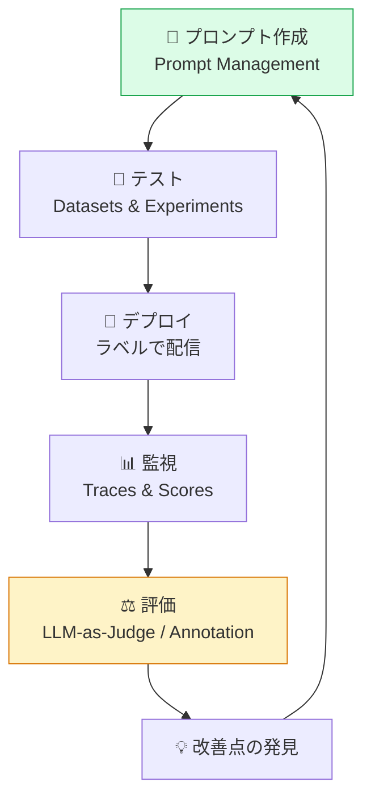

# Level 3: 中級 — 品質改善ループ

プロンプト管理・評価・データセットを活用して、LLMアプリケーションの品質を体系的に改善するサイクルを構築します。

## モジュール一覧

| # | タイトル | 所要時間 |
|---|---------|---------|
| 3-1 | [プロンプト管理](./3-1-prompt-management.md) | 60分 |
| 3-2 | [スコアリングと評価](./3-2-scoring.md) | 45分 |
| 3-3 | [LLM-as-a-Judge](./3-3-llm-as-judge.md) | 60分 |
| 3-4 | [データセットと実験](./3-4-datasets-experiments.md) | 60分 |
| 3-5 | [Playground活用](./3-5-playground.md) | 30分 |

## 学習目標

このレベルを修了すると、以下ができるようになります：

- プロンプトをバージョン管理し、安全にデプロイできる
- 複数の方法で品質スコアを収集・管理できる
- LLM-as-a-Judge で自動評価パイプラインを構築できる
- データセットを使って体系的な実験ができる
- Playgroundでプロンプトを迅速に反復改善できる

## 品質改善ループの全体像

