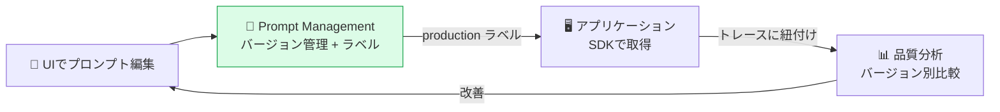
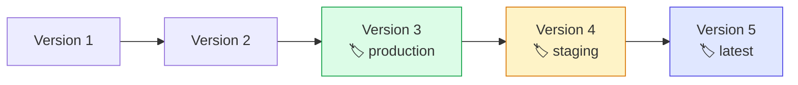

# モジュール 3-1: プロンプト管理

## 学習目標

- Langfuseでプロンプトを作成・バージョン管理できる
- ラベル（production / staging）でデプロイを制御できる
- SDKからプロンプトを取得して利用できる
- プロンプトのA/Bテストを実装できる

---

## 1. なぜプロンプト管理が必要か

### コード内プロンプトの問題

```python
# ❌ アンチパターン: プロンプトがコードにハードコード
response = openai.chat.completions.create(
    model="gpt-4o-mini",
    messages=[{"role": "system", "content": "あなたは親切なアシスタントです..."}],
)
```

| 問題 | 影響 |
|------|------|
| バージョン管理がコードと密結合 | プロンプト変更にデプロイが必要 |
| 非エンジニアが編集できない | プロダクトマネージャーが改善できない |
| A/Bテストが困難 | コード分岐が増える |
| どのバージョンが品質良いか不明 | トレースとの紐付けがない |

### Langfuseプロンプト管理の解決策



---

## 2. プロンプトの作成と管理（UI）

### UIでの操作手順

1. 左メニュー「Prompts」を開く
2. 「New Prompt」をクリック
3. 設定を入力：
   - **Name**: 一意な識別名（例: `customer-support-v1`）
   - **Type**: `Text` または `Chat`（メッセージ配列）
   - **Content**: プロンプトのテンプレート
4. 「Save」で新しいバージョンが作成される

### テンプレート変数

プロンプト内で `{{variable}}` 構文を使って変数を定義できます。

```
あなたは{{company_name}}のカスタマーサポートAIです。

ユーザーの質問に対して、以下のルールに従って回答してください：
- 丁寧な日本語で回答する
- 回答は{{max_sentences}}文以内にする
- 不明な点は正直に「わかりません」と答える

コンテキスト:
{{context}}
```

### Chat型プロンプト

メッセージ配列として定義：

```json
[
  {
    "role": "system",
    "content": "あなたは{{role}}です。{{language}}で回答してください。"
  },
  {
    "role": "user",
    "content": "{{user_input}}"
  }
]
```

---

## 3. バージョニングとラベル

### バージョンの仕組み

- プロンプトを保存するたびに新しい**バージョン番号**が付与される
- 過去のバージョンは全て保持される（削除されない）
- いつでも過去バージョンにロールバック可能

### ラベル（環境制御）

| ラベル | 用途 | 説明 |
|--------|------|------|
| `production` | 本番環境 | 安定版。十分にテスト済み |
| `staging` | ステージング | テスト中の次期バージョン |
| `latest` | 最新（自動） | 最後に保存されたバージョン |



### ラベルの付け替え

UIで「Promote to Production」等のボタンで簡単に切り替え可能。
コード変更やデプロイ不要でプロンプトを更新できます。

---

## 4. SDKからのプロンプト取得

### Python SDK

```python
from langfuse import Langfuse

langfuse = Langfuse()

# production ラベルのプロンプトを取得（デフォルト）
prompt = langfuse.get_prompt("customer-support-v1")

# 特定のラベルを指定
staging_prompt = langfuse.get_prompt("customer-support-v1", label="staging")

# 特定のバージョンを指定
v2_prompt = langfuse.get_prompt("customer-support-v1", version=2)
```

### テンプレート変数の適用

```python
# Text型プロンプトの場合
prompt = langfuse.get_prompt("customer-support-v1")
compiled = prompt.compile(
    company_name="Acme Corp",
    max_sentences="3",
    context="返品は30日以内であれば可能です。",
)
# → 変数が置換された文字列が返る

# Chat型プロンプトの場合
chat_prompt = langfuse.get_prompt("chat-assistant", type="chat")
messages = chat_prompt.compile(
    role="旅行ガイド",
    language="日本語",
    user_input="東京のおすすめスポットは？",
)
# → メッセージ配列が返る
```

### OpenAIとの組み合わせ

```python
from langfuse import observe
from openai import OpenAI
from langfuse import Langfuse

langfuse = Langfuse()

@observe()
def answer_question(question: str, context: str) -> str:
    # プロンプトを取得
    prompt = langfuse.get_prompt("qa-prompt")

    # Chat型の場合
    messages = prompt.compile(
        context=context,
        question=question,
    )

    # OpenAI呼び出し（プロンプトバージョンがトレースに紐付けられる）
    response = openai.chat.completions.create(
        model="gpt-4o-mini",
        messages=messages,
        langfuse_prompt=prompt,  # トレースにプロンプト情報を紐付け
    )

    return response.choices[0].message.content
```

### キャッシュ

SDKはプロンプトをローカルにキャッシュします。

```python
# キャッシュTTLの設定（デフォルト: 60秒）
langfuse = Langfuse(
    prompt_cache_ttl_seconds=300,  # 5分キャッシュ
)

# キャッシュ無効化（常に最新を取得）
prompt = langfuse.get_prompt("my-prompt", cache_ttl_seconds=0)
```

---

## 5. プロンプトのA/Bテスト

### 方法1: ラベルベースの切り替え

```python
import random

@observe()
def ab_test_response(question: str) -> str:
    # 50%の確率でA/Bを切り替え
    if random.random() < 0.5:
        prompt = langfuse.get_prompt("qa-prompt", label="production")  # A
        variant = "A"
    else:
        prompt = langfuse.get_prompt("qa-prompt", label="staging")  # B
        variant = "B"

    langfuse.update_current_trace(
        tags=[f"ab-variant-{variant}"],
        metadata={"ab_variant": variant, "prompt_version": prompt.version},
    )

    messages = prompt.compile(question=question)
    response = openai.chat.completions.create(
        model="gpt-4o-mini",
        messages=messages,
        langfuse_prompt=prompt,
    )
    return response.choices[0].message.content
```

### 方法2: バージョン直指定

```python
@observe()
def compare_versions(question: str) -> dict:
    results = {}

    for version in [3, 4, 5]:
        prompt = langfuse.get_prompt("qa-prompt", version=version)
        messages = prompt.compile(question=question)
        response = openai.chat.completions.create(
            model="gpt-4o-mini",
            messages=messages,
            langfuse_prompt=prompt,
        )
        results[f"v{version}"] = response.choices[0].message.content

    return results
```

---

## 6. ベストプラクティス

| 項目 | 推奨 |
|------|------|
| 命名規則 | `{機能}-{目的}` 形式（例: `support-greeting`） |
| 変数名 | 明確で一貫した命名（`{{user_query}}` not `{{q}}`） |
| ラベル運用 | staging でテスト → 問題なければ production に昇格 |
| 変更記録 | UIのコメント欄に変更理由を記載 |
| ロールバック | 品質低下時は即座に前バージョンに戻す |
| キャッシュ | 本番では適切なTTL（60〜300秒）を設定 |

---

## 確認問題

1. プロンプトのラベルとバージョンの違いは何ですか？
2. `langfuse_prompt=prompt` をOpenAI呼び出しに渡す理由は？
3. プロンプトのキャッシュはなぜ必要ですか？
4. A/Bテストの結果を分析するには、UIのどの機能を使いますか？

---

## 次のステップ

[モジュール 3-2: スコアリングと評価](./3-2-scoring.md) に進みましょう。
