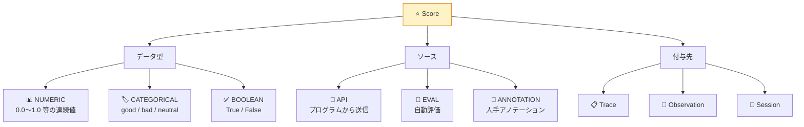
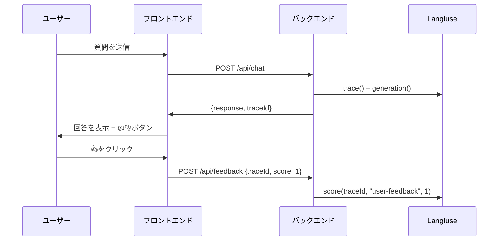

# モジュール 3-2: スコアリングと評価

## 学習目標

- スコアの種類（Numeric / Categorical / Boolean）を使い分けられる
- 各ソース（API / Eval / Annotation）からスコアを記録できる
- ユーザーフィードバック収集パイプラインを構築できる
- スコアを使ったフィルタと分析ができる

---

## 1. スコアの体系



---

## 2. APIからのスコア送信

### Python SDK

```python
from langfuse import Langfuse

langfuse = Langfuse()

# --- Numericスコア ---
langfuse.score(
    trace_id="trace-abc-123",
    name="relevance",
    value=0.85,
    data_type="NUMERIC",
    comment="コンテキストとの関連性が高い",
)

# --- Categoricalスコア ---
langfuse.score(
    trace_id="trace-abc-123",
    name="response-quality",
    value="good",
    data_type="CATEGORICAL",
    comment="正確で丁寧な回答",
)

# --- Booleanスコア ---
langfuse.score(
    trace_id="trace-abc-123",
    name="contains-hallucination",
    value=0,  # 0 = False, 1 = True
    data_type="BOOLEAN",
    comment="ハルシネーションなし",
)

# --- Observation（個別のLLM呼び出し）へのスコア ---
langfuse.score(
    trace_id="trace-abc-123",
    observation_id="gen-xyz-789",
    name="grammar",
    value=0.95,
    data_type="NUMERIC",
)
```

### @observe() デコレータ内でのスコア送信

```python
from langfuse import observe, Langfuse

@observe()
def process_and_evaluate(question: str) -> str:
    answer = generate_answer(question)

    # 自動品質チェック
    is_valid = len(answer) > 10 and not contains_profanity(answer)

    langfuse.score_current_trace(
        name="auto-validation",
        value=1 if is_valid else 0,
        data_type="BOOLEAN",
    )

    # 回答の長さに基づくスコア
    langfuse.score_current_trace(
        name="verbosity",
        value=min(len(answer) / 500, 1.0),
        data_type="NUMERIC",
    )

    return answer
```

---

## 3. ユーザーフィードバック収集

### アーキテクチャ



### バックエンド実装（Python / FastAPI）

```python
from fastapi import FastAPI
from pydantic import BaseModel
from langfuse import Langfuse
from langfuse import observe

app = FastAPI()
langfuse = Langfuse()

class ChatRequest(BaseModel):
    message: str
    session_id: str

class ChatResponse(BaseModel):
    response: str
    trace_id: str

class FeedbackRequest(BaseModel):
    trace_id: str
    score: int  # 1 = positive, 0 = negative
    comment: str = ""

@app.post("/api/chat")
@observe()
def chat(req: ChatRequest) -> ChatResponse:
    trace = langfuse.get_current_trace()

    langfuse.update_current_trace(
        session_id=req.session_id,
    )

    answer = generate_response(req.message)

    return ChatResponse(
        response=answer,
        trace_id=trace.id,
    )

@app.post("/api/feedback")
def feedback(req: FeedbackRequest):
    langfuse.score(
        trace_id=req.trace_id,
        name="user-feedback",
        value=req.score,
        data_type="BOOLEAN",
        comment=req.comment,
    )
    langfuse.flush()
    return {"status": "ok"}
```

### フロントエンド実装（React）

```typescript
function ChatMessage({ message, traceId }: { message: string; traceId: string }) {
  const [feedbackSent, setFeedbackSent] = useState(false);

  const sendFeedback = async (score: number) => {
    await fetch("/api/feedback", {
      method: "POST",
      headers: { "Content-Type": "application/json" },
      body: JSON.stringify({ trace_id: traceId, score }),
    });
    setFeedbackSent(true);
  };

  return (
    <div>
      <p>{message}</p>
      {!feedbackSent && (
        <div>
          <button onClick={() => sendFeedback(1)}>👍</button>
          <button onClick={() => sendFeedback(0)}>👎</button>
        </div>
      )}
    </div>
  );
}
```

---

## 4. Score Config（スコア設定）

UIの「Settings」→「Score Configs」で、アノテーション用のスコア定義を作成できます。

### 設定項目

| 項目 | 説明 | 例 |
|------|------|-----|
| Name | スコア名 | `relevance`, `helpfulness` |
| Data Type | データ型 | NUMERIC / CATEGORICAL / BOOLEAN |
| Min / Max | 数値の範囲（NUMERIC時） | 0〜5 |
| Categories | カテゴリ一覧（CATEGORICAL時） | good, acceptable, bad |
| Description | 評価基準の説明 | 「回答が質問に対して関連性があるか」 |

---

## 5. スコアを使った分析

### UIでのフィルタ

- Tracing画面で「Score」フィルタを追加
- 例: `user-feedback = 0` で否定的フィードバックのみ表示
- 例: `relevance < 0.5` で低品質トレースを抽出

### ダッシュボードでの集計

- スコアの平均値の推移
- バージョン/タグ別のスコア比較
- スコアとコスト/レイテンシの相関

### APIでのスコア取得

```python
# 特定トレースのスコアを取得
scores = langfuse.get_scores(trace_id="trace-abc-123")
for score in scores:
    print(f"{score.name}: {score.value} (source: {score.source})")
```

---

## 6. 複合評価パターン

### 多次元評価

```python
def evaluate_response(trace_id: str, question: str, answer: str, context: str):
    """複数の観点からスコアを付与"""

    # 1. 関連性（回答がコンテキストに基づいているか）
    langfuse.score(
        trace_id=trace_id,
        name="relevance",
        value=calculate_relevance(answer, context),
        data_type="NUMERIC",
    )

    # 2. 完全性（質問に十分に回答しているか）
    langfuse.score(
        trace_id=trace_id,
        name="completeness",
        value=calculate_completeness(question, answer),
        data_type="NUMERIC",
    )

    # 3. 簡潔性（冗長でないか）
    langfuse.score(
        trace_id=trace_id,
        name="conciseness",
        value="concise" if len(answer) < 500 else "verbose",
        data_type="CATEGORICAL",
    )

    # 4. 安全性（有害コンテンツがないか）
    langfuse.score(
        trace_id=trace_id,
        name="safety",
        value=1 if is_safe(answer) else 0,
        data_type="BOOLEAN",
    )
```

---

## 確認問題

1. NUMERIC / CATEGORICAL / BOOLEAN スコアの使い分けを例を挙げて説明してください
2. ユーザーフィードバックをLangfuseに記録する際、なぜtrace_idをフロントエンドに返す必要がありますか？
3. Score Config はどのような場面で設定しますか？
4. スコアのsource「API」「EVAL」「ANNOTATION」の違いは？

---

## 次のステップ

[モジュール 3-3: LLM-as-a-Judge](./3-3-llm-as-judge.md) に進みましょう。
