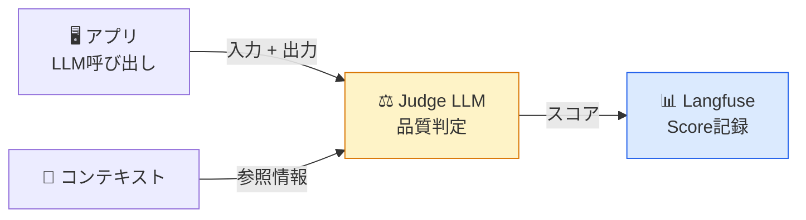
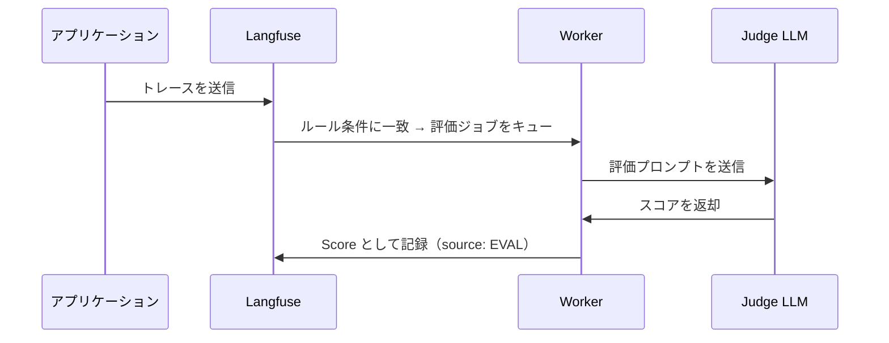

# モジュール 3-3: LLM-as-a-Judge

## 学習目標

- LLM-as-a-Judge の概念と適用場面を理解する
- Langfuse UIでEvaluatorテンプレートを作成できる
- Evaluation Rulesで自動評価パイプラインを構築できる
- 評価結果を分析して品質改善に活かせる

---

## 1. LLM-as-a-Judge とは

### 概念

**別のLLMを「審査員」として使い、LLMの出力品質を自動判定する**手法です。



### メリットと注意点

| メリット | 注意点 |
|---------|--------|
| 大量トレースを自動評価可能 | Judge LLM自体の品質に依存 |
| 人手アノテーションの10〜100倍速い | コストが追加で発生 |
| 一貫した評価基準 | 完全な正確性は保証されない |
| 24/7で評価が回る | 人手評価との相関検証が必要 |

---

## 2. Evaluatorテンプレートの作成

### UIでの作成手順

1. 左メニュー「Evaluators」を開く
2. 「New Template」をクリック
3. 以下を設定：

### テンプレートの構成要素

| 要素 | 説明 |
|------|------|
| **Name** | テンプレートの識別名 |
| **Model** | Judge に使うLLMモデル |
| **Prompt** | 評価指示のプロンプト |
| **Variables** | トレースから取得する変数 |
| **Output Schema** | 期待する出力形式（スコア型） |

### テンプレート例: 関連性評価

```
あなたは回答の品質を評価する審査員です。

以下の「質問」と「回答」を見て、回答が質問に対してどの程度関連性があるかを評価してください。

## 質問
{{input}}

## 回答
{{output}}

## 評価基準
- 1.0: 完全に関連性がある。質問に正確に回答している
- 0.7: 概ね関連性がある。主要な部分は回答しているが、一部不足
- 0.4: 部分的に関連性がある。回答の一部のみ質問に関連
- 0.1: ほとんど関連性がない

## 出力
0.0〜1.0 の数値のみを出力してください。
```

### テンプレート例: ハルシネーション検出

```
あなたはファクトチェッカーです。

与えられたコンテキストと回答を比較し、回答にハルシネーション（コンテキストに基づかない虚偽の情報）が含まれているかを判定してください。

## コンテキスト（事実情報）
{{context}}

## 回答
{{output}}

## 判定
- "no_hallucination": 回答はすべてコンテキストに基づいている
- "minor_hallucination": 些細な付加情報があるが、致命的ではない
- "major_hallucination": コンテキストに反する重大な虚偽情報がある

上記のいずれか1つのみ出力してください。
```

---

## 3. Evaluation Rules（自動評価ルール）

### ルールの設定

UIの「Evaluators」で新規ルールを作成：

| 設定項目 | 説明 | 例 |
|---------|------|-----|
| **Name** | ルール名 | "Auto Relevance Check" |
| **Template** | 使用するテンプレート | "relevance-evaluator" |
| **Trigger** | 評価対象の条件 | name = "rag-response" |
| **Sampling** | サンプリング率 | 100%（全て）or 20%（抽出） |
| **Delay** | 実行までの遅延 | 0秒（即時）or 60秒（バッチ） |

### 変数のマッピング

テンプレートの変数 `{{input}}`, `{{output}}`, `{{context}}` を
トレースのどのフィールドから取得するかを指定：

| テンプレート変数 | マッピング先 |
|-----------------|-------------|
| `{{input}}` | `trace.input` |
| `{{output}}` | `trace.output` |
| `{{context}}` | `trace.metadata.context` |
| `{{observation_output}}` | `observation.output`（特定Observation） |

### フロー



---

## 4. カスタム評価の実装（SDK）

UIのルールだけでなく、SDKから独自の評価ロジックを実装することもできます。

```python
from langfuse import Langfuse
from langfuse import observe
from openai import OpenAI

langfuse = Langfuse()

JUDGE_PROMPT = """あなたは回答品質の審査員です。

質問: {question}
回答: {answer}

以下の観点で0〜10点で評価してください:
1. 正確性
2. 網羅性
3. 簡潔性

JSON形式で出力:
{{"accuracy": <score>, "completeness": <score>, "conciseness": <score>}}
"""

@observe()
def evaluate_with_llm(trace_id: str, question: str, answer: str):
    """トレースをLLM-as-Judgeで評価"""
    response = openai.chat.completions.create(
        model="gpt-4o",  # Judgeには高性能モデルを使用
        messages=[{
            "role": "user",
            "content": JUDGE_PROMPT.format(question=question, answer=answer),
        }],
        response_format={"type": "json_object"},
        name="judge-evaluation",
    )

    import json
    scores = json.loads(response.choices[0].message.content)

    # 各スコアをLangfuseに記録
    for metric, value in scores.items():
        langfuse.score(
            trace_id=trace_id,
            name=f"judge-{metric}",
            value=value / 10.0,  # 0〜1に正規化
            data_type="NUMERIC",
            comment=f"LLM-as-Judge ({metric})",
        )

    langfuse.flush()
    return scores
```

### バッチ評価

```python
def batch_evaluate(trace_ids: list[str]):
    """複数トレースを一括評価"""
    for trace_id in trace_ids:
        trace_data = langfuse.get_trace(trace_id)
        evaluate_with_llm(
            trace_id=trace_id,
            question=trace_data.input.get("question", ""),
            answer=trace_data.output.get("response", ""),
        )
```

---

## 5. 評価結果の分析

### UIでの確認

- **Tracing画面**: スコア列でソート → 低品質トレースを特定
- **Evaluators画面**: ルールの実行状況、成功/失敗率
- **Dashboards**: スコアの時系列推移、分布

### 品質改善への活用

| スコア傾向 | アクション |
|-----------|-----------|
| relevance が低下 | プロンプトの指示を強化 |
| hallucination が増加 | コンテキスト量を増やす / Temperature下げる |
| conciseness が低い | 「簡潔に」の指示を追加 |
| accuracy が不安定 | few-shot例を追加 |

---

## 6. 人手評価との比較（キャリブレーション）

LLM-as-Judgeの信頼性を担保するため、定期的に人手評価と比較します。

```python
def calibration_check():
    """人手評価とLLM評価の一致率を計算"""
    traces_with_both = get_traces_with_annotation_and_eval_scores()

    agreements = 0
    total = 0

    for trace in traces_with_both:
        human_score = trace.scores["annotation"]["relevance"]
        llm_score = trace.scores["eval"]["judge-relevance"]

        # ±0.2以内を「一致」とみなす
        if abs(human_score - llm_score) <= 0.2:
            agreements += 1
        total += 1

    agreement_rate = agreements / total
    print(f"一致率: {agreement_rate:.1%}")
    # 目標: 80%以上
```

---

## 確認問題

1. LLM-as-a-Judgeはどのような場面で特に有効ですか？
2. Evaluatorテンプレートの「Variables」は何のために使いますか？
3. サンプリング率を100%にしない理由は何ですか？
4. Judge LLMのモデル選択で考慮すべき点は？

---

## 次のステップ

[モジュール 3-4: データセットと実験](./3-4-datasets-experiments.md) に進みましょう。
