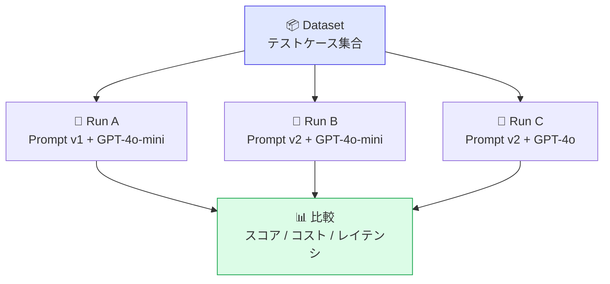

# モジュール 3-4: データセットと実験

## 学習目標

- Datasetの作成と管理ができる（UI/API）
- DatasetItemの設計と運用ができる
- 実験（Experiment）を実行し、結果を比較できる
- データセットを使った回帰テストを構築できる

---

## 1. データセットの概念

### なぜデータセットが必要か

プロンプトやモデルを変更するとき、「前より良くなったか？」を客観的に判断するために、
固定されたテストケースの集合が必要です。



### データモデル

| オブジェクト | 説明 |
|-------------|------|
| **Dataset** | テストケースのコレクション |
| **DatasetItem** | 個々のテストケース（input + expectedOutput） |
| **DatasetRun** | データセットに対する1回の実行 |
| **DatasetRunItem** | 各テストケースの実行結果（Traceに紐付き） |

---

## 2. データセットの作成

### UIでの作成

1. 左メニュー「Datasets」→「New Dataset」
2. Dataset名を入力（例: `qa-regression-test`）
3. 「Add Item」で個別にテストケースを追加

### APIでの作成

```python
from langfuse import Langfuse

langfuse = Langfuse()

# データセット作成
dataset = langfuse.create_dataset(
    name="customer-support-qa",
    description="カスタマーサポートQAの回帰テスト用データセット",
    metadata={"version": "1.0", "domain": "support"},
)

# アイテム追加
langfuse.create_dataset_item(
    dataset_name="customer-support-qa",
    input={"question": "返品ポリシーを教えてください"},
    expected_output="当社の返品ポリシーは購入後30日以内であれば...",
    metadata={"category": "returns", "difficulty": "easy"},
)

langfuse.create_dataset_item(
    dataset_name="customer-support-qa",
    input={"question": "注文のキャンセル方法は？"},
    expected_output="注文のキャンセルは発送前であれば...",
    metadata={"category": "orders", "difficulty": "easy"},
)

langfuse.create_dataset_item(
    dataset_name="customer-support-qa",
    input={"question": "海外発送は対応していますか？送料はいくら？"},
    expected_output="海外発送は対応しています。送料は地域により...",
    metadata={"category": "shipping", "difficulty": "medium"},
)
```

### トレースからのアイテム作成

本番トレースの中から良い/悪い例をデータセットに追加：

```python
# UIから: Trace詳細画面 → 「Add to Dataset」ボタン
# APIから:
langfuse.create_dataset_item(
    dataset_name="customer-support-qa",
    input=trace.input,
    expected_output=trace.output,  # 良い回答例として
    source_trace_id=trace.id,
    metadata={"source": "production", "quality": "good"},
)
```

---

## 3. 実験の実行

### 基本的な実験ループ

```python
from langfuse import Langfuse
from langfuse import observe, Langfuse

langfuse = Langfuse()

@observe()
def run_qa(question: str, system_prompt: str) -> str:
    """テスト対象の関数"""
    response = openai.chat.completions.create(
        model="gpt-4o-mini",
        messages=[
            {"role": "system", "content": system_prompt},
            {"role": "user", "content": question},
        ],
    )
    return response.choices[0].message.content

def run_experiment(
    dataset_name: str,
    run_name: str,
    system_prompt: str,
):
    """データセット全体に対して実験を実行"""
    dataset = langfuse.get_dataset(dataset_name)

    for item in dataset.items:
        # 各アイテムに対してトレースを実行
        with item.observe(run_name=run_name) as trace_id:
            result = run_qa(
                question=item.input["question"],
                system_prompt=system_prompt,
            )

            # 自動評価（オプション）
            langfuse.score(
                trace_id=trace_id,
                name="exact-match",
                value=1 if result.strip() == item.expected_output.strip() else 0,
                data_type="BOOLEAN",
            )

    langfuse.flush()
    print(f"✅ 実験 '{run_name}' が完了しました")

# 実験A: 元のプロンプト
run_experiment(
    dataset_name="customer-support-qa",
    run_name="baseline-v1",
    system_prompt="あなたはカスタマーサポートです。質問に回答してください。",
)

# 実験B: 改善したプロンプト
run_experiment(
    dataset_name="customer-support-qa",
    run_name="improved-v2",
    system_prompt="あなたは丁寧で正確なカスタマーサポートです。簡潔に、具体的に回答してください。不明な点は正直に伝えてください。",
)
```

### observe コンテキストを使った方法

```python
from langfuse import observe, Langfuse

@observe()
def my_llm_application(question: str) -> str:
    # ... 実際のアプリケーションロジック ...
    return answer

def run_experiment_v2(dataset_name: str, run_name: str):
    dataset = langfuse.get_dataset(dataset_name)

    for item in dataset.items:
        # observe内でトレースとDatasetRunItemの紐付け
        handler = item.get_langchain_handler(run_name=run_name)

        # または @observe ベース
        with item.observe(
            run_name=run_name,
            run_metadata={"model": "gpt-4o-mini", "prompt_version": "v2"},
        ) as trace_id:
            output = my_llm_application(item.input["question"])

            # スコア付け
            langfuse.score(
                trace_id=trace_id,
                name="similarity",
                value=compute_similarity(output, item.expected_output),
                data_type="NUMERIC",
            )
```

---

## 4. 結果の比較

### UIでの比較

1. 「Datasets」→ データセットを選択
2. 「Runs」タブで実行結果の一覧
3. 複数のRunを選択して「Compare」

### 比較指標

| 指標 | 説明 |
|------|------|
| スコア平均 | 各評価メトリクスの平均値 |
| スコア分布 | ヒストグラムでの分布比較 |
| コスト合計 | トークン使用量と推定コスト |
| レイテンシ | 応答時間の平均・P95 |
| 成功率 | エラーなく完了した割合 |

### プログラムでの結果取得

```python
# 実験結果を取得して分析
runs = langfuse.get_dataset_runs(dataset_name="customer-support-qa")

for run in runs:
    print(f"\n--- {run.name} ---")
    print(f"  Items: {run.dataset_run_items_count}")
    print(f"  Created: {run.created_at}")

    # 各アイテムの結果
    for item in run.dataset_run_items:
        trace = langfuse.get_trace(item.trace_id)
        scores = {s.name: s.value for s in trace.scores}
        print(f"  Item: {item.dataset_item_id} → Scores: {scores}")
```

---

## 5. 実験のベストプラクティス

### データセット設計

| 項目 | 推奨 |
|------|------|
| サイズ | 最低20〜50件。網羅性を意識 |
| 多様性 | 簡単/普通/難しいケースを含める |
| エッジケース | 境界値、曖昧な入力、長文入力 |
| メタデータ | カテゴリ、難易度、ソースを付与 |
| 更新 | 本番で問題が見つかるたびに追加 |

### 実験の命名規則

```
{目的}-{変更点}-{日付}
例:
  baseline-gpt4omini-20240101
  improved-prompt-v2-20240115
  model-comparison-claude-20240120
```

### CI/CDへの組み込み

```python
def test_regression():
    """CIで回帰テストとして実行"""
    run_name = f"ci-{os.environ.get('CI_COMMIT_SHA', 'local')}"
    run_experiment("regression-dataset", run_name, current_prompt)

    # 結果を検証
    results = get_run_scores(run_name)
    assert results["relevance_avg"] >= 0.8, "品質低下を検出"
    assert results["cost_total"] <= 1.0, "コスト超過を検出"
```

---

## 確認問題

1. DatasetItemの `expected_output` は必須ですか？どのような場合に省略しますか？
2. 実験のRunとTraceはどのように紐づきますか？
3. データセットに本番トレースを追加するメリットは？
4. 実験結果で「統計的に有意な差」をどう判断しますか？

---

## 次のステップ

[モジュール 3-5: Playground活用](./3-5-playground.md) に進みましょう。
