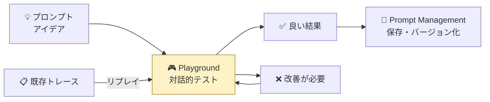
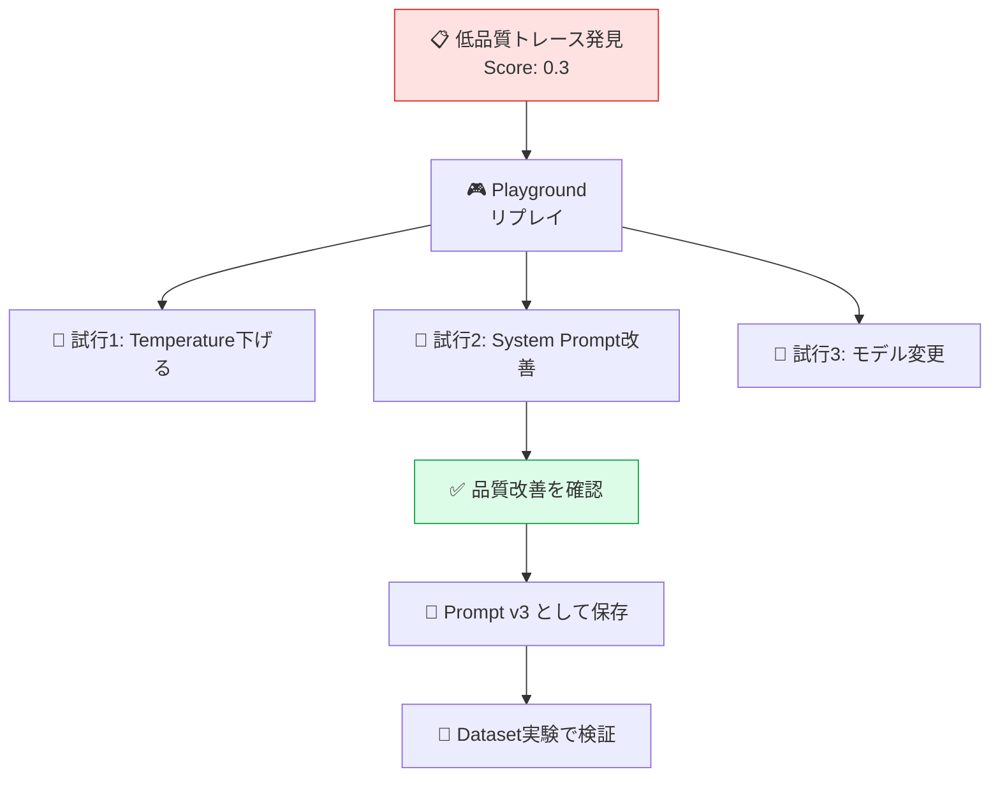

# モジュール 3-5: Playground活用

## 学習目標

- Playgroundでプロンプトを対話的にテストできる
- トレースからPlaygroundへリプレイできる
- モデル/パラメータの比較検証ができる
- PlaygroundからPrompt Managementへの流れを実践できる

---

## 1. Playgroundとは

Playgroundは、Langfuse UI上で**プロンプトをリアルタイムにテスト**できる対話的ツールです。
コードを書かずにプロンプトの改善サイクルを素早く回せます。



---

## 2. 基本操作

### Playgroundの開き方

1. 左メニュー「Playground」をクリック
2. または、Trace詳細画面から「Open in Playground」ボタン

### UIの構成

| エリア | 説明 |
|--------|------|
| **Model設定** | モデル、temperature、max_tokens等 |
| **System Prompt** | システムメッセージ |
| **Messages** | ユーザー/アシスタントメッセージの編集 |
| **Run** | 実行ボタン。結果がリアルタイム表示 |
| **LLM接続設定** | APIキーの選択 |

### 利用の前提条件

- プロジェクトの Settings → LLM API Keys にモデルのAPIキーが設定されていること
- または、Self-hosted環境で設定済みのLLM接続があること

---

## 3. トレースからのリプレイ

### ユースケース

- 本番で品質が低かったトレースの原因調査
- パラメータ変更による改善効果の確認
- 同じ入力で別モデルを試す

### 手順

1. Tracing画面で問題のあるトレースを開く
2. Generation（LLM呼び出し）の右上「▶ Playground」をクリック
3. 入力メッセージ、モデル、パラメータがそのまま復元される
4. パラメータを変更して再実行

### リプレイからの改善フロー



---

## 4. モデル・パラメータ比較

### Temperature の影響を確認

同じプロンプトで Temperature を変えて実行：

| Temperature | 特徴 | 向いている場面 |
|------------|------|---------------|
| 0.0 | 決定的、一貫した出力 | ファクト回答、分類 |
| 0.3 | やや創造的 | 一般的なQ&A |
| 0.7 | バランス | チャットボット |
| 1.0 | 非常に創造的 | ブレインストーミング |

### モデル比較の手順

1. Playgroundで基準となるプロンプトとメッセージを設定
2. Model を切り替えて実行（例: gpt-4o-mini → gpt-4o → claude-3.5-sonnet）
3. 出力品質、トークン数、レイテンシを目視比較
4. コストパフォーマンスの判断

---

## 5. Prompt Managementとの連携

### PlaygroundからPromptを保存

1. Playgroundで良い結果が出るプロンプトを確定
2. 「Save as Prompt」ボタンをクリック
3. Prompt名を指定して保存
4. 自動的にPrompt Management に新バージョンとして追加

### Promptを Playground で開く

1. Prompts画面でプロンプトを選択
2. 「Open in Playground」をクリック
3. テスト入力を入力して実行
4. 改善したら「Save」で新バージョンとして保存

---

## 6. 活用パターン

### パターン1: プロンプトエンジニアリング

```
1. Playgroundで様々なプロンプト表現をテスト
2. 最良版を Prompt として保存
3. Dataset で網羅的にテスト
4. 問題なければ production ラベルを付与
```

### パターン2: インシデント調査

```
1. アラートで品質低下を検知
2. 該当トレースをPlaygroundでリプレイ
3. 入力パターンを変えて問題の再現条件を特定
4. プロンプト修正 → 再テスト → デプロイ
```

### パターン3: 新機能のプロトタイプ

```
1. 新しいユースケースのプロンプトをPlaygroundで作成
2. 複数パターンを試してベストを選定
3. Promptとして保存
4. SDKから呼び出すコードを実装
```

---

## Level 3 修了チェックリスト

- [ ] Prompt Management でバージョン管理・ラベル運用ができる
- [ ] SDKからプロンプトを取得し、トレースに紐付けられる
- [ ] 複数の方法でスコアを記録できる
- [ ] ユーザーフィードバック収集パイプラインを構築できる
- [ ] LLM-as-a-Judge で自動評価ルールを設定できる
- [ ] データセットを作成し、体系的な実験を実行できる
- [ ] Playgroundでプロンプトの迅速な反復改善ができる

---

## 次のレベルへ

[Level 4: 上級](../level-4/) では、本番運用に必要なダッシュボード設計、
アノテーションワークフロー、自動化、セキュリティを学びます。
