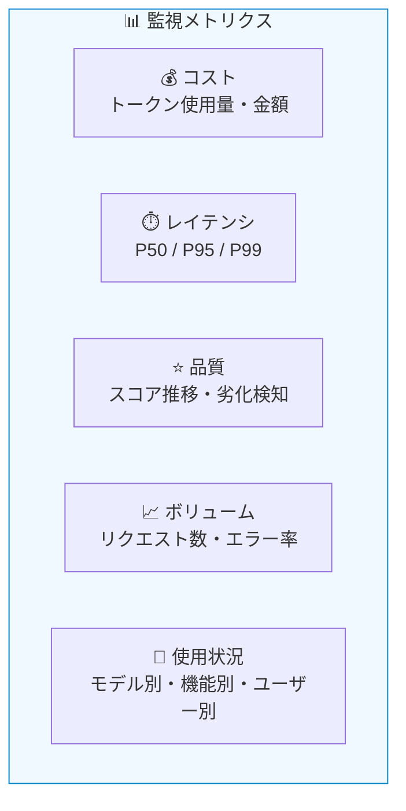
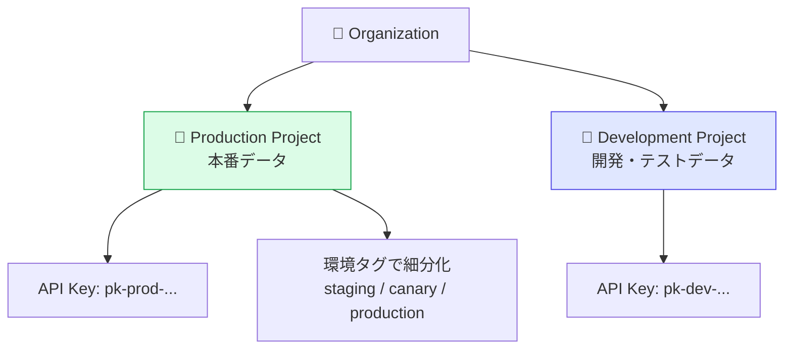

# モジュール 4-1: 本番運用設計

## 学習目標

- コスト・レイテンシの監視ダッシュボードを設計できる
- 環境（dev / staging / production）の分離戦略を実装できる
- 本番メトリクスに基づいた改善サイクルを回せる

---

## 1. 本番監視の設計

### 監視すべきメトリクス



| メトリクス | KPI例 | アラート条件 |
|-----------|-------|-------------|
| コスト | 日次 $50以下 | 日次 $75超過 |
| レイテンシ(P95) | 3秒以下 | 5秒超過 |
| エラー率 | 1%以下 | 5%超過 |
| 品質スコア平均 | 0.8以上 | 0.6未満 |
| トレース数 | 日次1000件 | 前日比50%減少 |

---

## 2. ダッシュボード設計

### UIでのダッシュボード構築

1. 「Dashboards」→「New Dashboard」
2. ウィジェットを追加して配置
3. フィルタとグルーピングを設定

### 推奨ダッシュボード構成

#### エグゼクティブダッシュボード（週次確認用）

| ウィジェット | 内容 |
|------------|------|
| コスト推移（日次） | 直近30日のコスト折れ線グラフ |
| モデル別コスト割合 | 円グラフ |
| 品質スコア推移 | 主要スコアの日次平均 |
| トレース数推移 | リクエストボリューム |

#### オペレーションダッシュボード（日次確認用）

| ウィジェット | 内容 |
|------------|------|
| エラートレース | 直近24時間のエラー一覧 |
| レイテンシ分布 | P50/P95/P99のヒートマップ |
| 低品質トレース | スコア < 0.5 のトレース数 |
| ユーザーフィードバック | 👎の件数と傾向 |

---

## 3. 環境分離

### environment フィールドの活用

```python
from langfuse import observe, Langfuse
import os

ENVIRONMENT = os.environ.get("APP_ENV", "development")

@observe()
def handle_request(user_input: str):
    langfuse.update_current_trace(
        tags=[ENVIRONMENT],
        metadata={"environment": ENVIRONMENT},
    )
    # ... 処理 ...
```

### プロジェクト分離 vs タグ/環境分離

| 戦略 | メリット | デメリット |
|------|---------|-----------|
| **プロジェクト分離** | 完全なデータ隔離、別APIキー | 横断分析が困難 |
| **タグ/環境フィルタ** | 統一的な分析、設定が簡単 | データが混在 |

### 推奨: ハイブリッドアプローチ



---

## 4. コスト最適化

### コスト分析の手順

1. ダッシュボードでモデル別コストを確認
2. 高コストトレースを特定（ソート: cost DESC）
3. 不要に大きなプロンプト/コンテキストがないか確認
4. 最適なモデルサイズを検討

### 最適化テクニック

| テクニック | 効果 | 実装難易度 |
|-----------|------|-----------|
| モデルダウングレード（簡易タスク） | 50〜90%削減 | 低 |
| プロンプト短縮 | 10〜30%削減 | 低 |
| キャッシュ導入 | 30〜70%削減 | 中 |
| Routing（タスク難易度別モデル） | 40〜60%削減 | 高 |

```python
@observe()
def smart_routing(question: str) -> str:
    """難易度に応じてモデルを使い分け"""
    complexity = classify_complexity(question)

    if complexity == "simple":
        model = "gpt-4o-mini"  # $0.15/1M input tokens
    elif complexity == "medium":
        model = "gpt-4o"       # $2.50/1M input tokens
    else:
        model = "gpt-4o"       # 高品質モデル

    langfuse.update_current_trace(
        metadata={"complexity": complexity, "model": model},
    )

    return call_llm(question, model=model)
```

---

## 5. レイテンシ最適化

### ボトルネック特定

Trace詳細のウォーターフォール表示で、どのステップが遅いかを特定：

```mermaid
gantt
    title トレースのタイムライン
    dateFormat X
    axisFormat %Lms

    section Pipeline
    前処理           :0, 50
    ドキュメント検索  :50, 300
    Embedding生成    :50, 100
    ベクトル検索     :100, 300
    LLM生成         :300, 1500
    後処理           :1500, 1550
```



### 最適化パターン

- **並列化**: 独立したステップを並列実行
- **ストリーミング**: TTFB（最初のトークンまでの時間）を短縮
- **キャッシュ**: 頻出クエリの結果をキャッシュ
- **プロンプト最適化**: 入力トークンの削減

---

## 確認問題

1. 本番環境で最低限監視すべきメトリクスを5つ挙げてください
2. 環境分離で「プロジェクト分離」と「タグ分離」それぞれのトレードオフは？
3. コスト最適化で最も効果が高い手法は何ですか？
4. レイテンシのボトルネックをLangfuse UIで特定する方法は？

---

## 次のステップ

[モジュール 4-2: アノテーションワークフロー](./4-2-annotation-workflows.md) に進みましょう。
