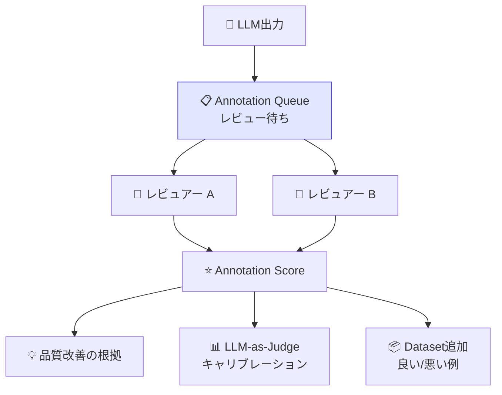

# モジュール 4-2: アノテーションワークフロー

## 学習目標

- Annotation Queuesを設計・作成できる
- チームでのレビュープロセスを構築できる
- アノテーション品質を管理するKPIを設定できる

---

## 1. アノテーションの役割



### なぜ人手アノテーションが必要か

| 目的 | 説明 |
|------|------|
| 品質の真実値 | LLM-as-Judgeの精度検証に必要 |
| エッジケース発見 | 自動評価が見逃すパターン |
| ドメイン知識の活用 | 専門的な正確性は人が判断 |
| 継続的なデータセット拡充 | 良い/悪い例を蓄積 |

---

## 2. Annotation Queue の設計

### UIでの作成

1. 「Human Annotation」→「New Queue」
2. 設定を入力：

| 設定項目 | 説明 | 例 |
|---------|------|-----|
| **Name** | キュー名 | "daily-review" |
| **Score Configs** | 使用するスコア定義 | relevance, helpfulness |
| **Filter** | 対象トレースの条件 | tags contains "production" |
| **Sampling** | サンプリング率 | 10%（1日100件程度） |

### キュー設計パターン

| パターン | フィルタ条件 | レビュアー | 頻度 |
|---------|------------|-----------|------|
| 日次品質チェック | random 10% | 全員 | 毎日 |
| 低スコア重点レビュー | eval-score < 0.5 | シニア | 即時 |
| 新機能レビュー | tags = "new-feature" | PdM + エンジニア | リリース後 |
| ネガティブフィードバック | user-feedback = 0 | 全員 | 毎日 |

---

## 3. アノテーション作業フロー

### レビュアーの操作

1. 「Human Annotation」から割り当てられたキューを開く
2. トレースが1件ずつ表示される
3. 入力・出力を確認し、Score Config に従ってスコアを付与
4. コメントを追加（改善提案など）
5. 「Next」で次のアイテムへ

### スコアリング基準の文書化

```markdown
## Relevance（関連性）スコアリングガイド

### 5点: 完璧
- 質問に対して完全に正確で過不足のない回答

### 4点: 良好
- 回答は正確だが、わずかな補足があればなお良い

### 3点: 許容
- 部分的に正しいが、重要な情報が欠けている

### 2点: 不十分
- 回答の大部分が質問と無関係

### 1点: 不適切
- 完全に誤った情報、またはハルシネーション
```

---

## 4. 品質管理KPI

| KPI | 計算方法 | 目標 |
|-----|---------|------|
| アノテーション完了率 | 完了件数 / キュー総数 | 95%以上 |
| レビュアー間一致率 | Cohen's Kappa | 0.7以上 |
| 平均レビュー時間 | 合計時間 / 件数 | 2分以内 |
| LLM-Judge相関 | Pearson r | 0.8以上 |
| アクショナブル率 | 改善に繋がった件数 / 全件 | 30%以上 |

---

## 確認問題

1. Annotation Queueのサンプリング率を決める際の考慮点は？
2. レビュアー間一致率が低い場合、何をすべきですか？
3. アノテーション結果をLLM-as-Judgeの改善にどう活かしますか？

---

## 次のステップ

[モジュール 4-3: 自動化とアラート](./4-3-automation-alerts.md) に進みましょう。
