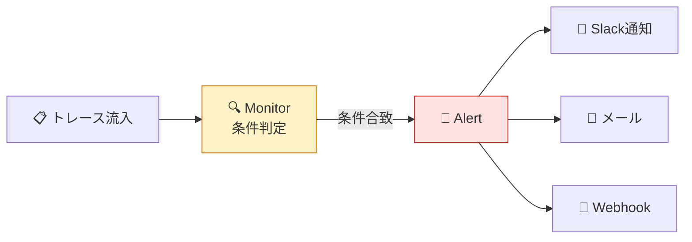
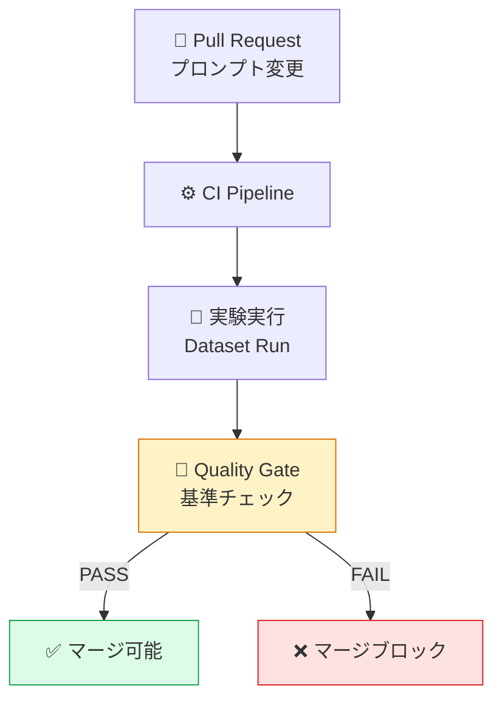

# モジュール 4-3: 自動化とアラート

## 学習目標

- Monitors/Alertsで異常検知を設定できる
- Automations/Webhooksで外部連携パイプラインを構築できる
- CI/CDパイプラインにLangfuse品質チェックを組み込める

---

## 1. Monitors & Alerts

### 監視ルールの設計



### UIでの設定

1. 「Monitors」→「New Monitor」
2. 条件を設定：

| 設定 | 説明 | 例 |
|------|------|-----|
| **Metric** | 監視対象 | trace count, cost, latency, score |
| **Condition** | 発火条件 | value > threshold |
| **Window** | 集計期間 | 1時間 / 24時間 |
| **Threshold** | しきい値 | cost > $100, latency > 5s |
| **Notification** | 通知先 | Slack, Email, Webhook |

### 推奨アラートルール

| ルール名 | 条件 | 優先度 |
|---------|------|--------|
| コスト急増 | 時間コスト > 前日平均 × 3 | High |
| エラー率上昇 | エラー率 > 5% (1時間) | High |
| レイテンシ劣化 | P95 > 10秒 (1時間) | Medium |
| 品質スコア低下 | 平均スコア < 0.6 (24時間) | Medium |
| トラフィック異常 | トレース数 < 前日の10% | Low |

---

## 2. Automations & Webhooks

### Automationsの設定

トリガー条件に基づいて自動アクションを実行：

| トリガー | アクション | ユースケース |
|---------|-----------|-------------|
| score < 0.3 | Annotation Queueに追加 | 低品質の自動レビュー |
| error = true | Webhookを送信 | エラー追跡システム連携 |
| cost > $1 | タグを追加 | 高コストトレースの可視化 |
| new trace (sampled) | Eval実行 | 自動品質評価 |

### Webhook設定

```json
{
  "url": "https://your-server.com/langfuse-webhook",
  "events": ["trace.created", "score.created"],
  "filter": {
    "tags": ["production"],
    "environment": "production"
  },
  "headers": {
    "Authorization": "Bearer your-secret-token"
  }
}
```

### Webhook受信サーバー例

```python
from fastapi import FastAPI, Request
import httpx

app = FastAPI()

@app.post("/langfuse-webhook")
async def handle_webhook(request: Request):
    payload = await request.json()
    event_type = payload["event"]

    if event_type == "trace.created":
        trace = payload["data"]
        # 低品質トレースをSlackに通知
        if trace.get("scores", {}).get("quality", 1.0) < 0.5:
            await notify_slack(
                f"⚠️ 低品質トレース検出: {trace['id']}\n"
                f"Name: {trace['name']}\n"
                f"Score: {trace['scores']['quality']}"
            )

    return {"status": "ok"}
```

---

## 3. CI/CDパイプライン統合

### 品質ゲートの実装

```python
"""CI/CDで実行する品質チェックスクリプト"""
import sys
from langfuse import Langfuse

langfuse = Langfuse()

def run_quality_gate(dataset_name: str, run_name: str) -> bool:
    """データセット実験を実行し、品質基準をチェック"""

    # 実験実行（別スクリプトで実行済みと仮定）
    runs = langfuse.get_dataset_runs(dataset_name=dataset_name)
    current_run = next(r for r in runs if r.name == run_name)

    # スコア集計
    scores = collect_scores(current_run)

    # 品質ゲート
    gates = {
        "relevance_avg >= 0.8": scores["relevance_avg"] >= 0.8,
        "hallucination_rate <= 0.05": scores["hallucination_rate"] <= 0.05,
        "error_rate <= 0.01": scores["error_rate"] <= 0.01,
        "avg_latency <= 3.0s": scores["avg_latency"] <= 3.0,
        "cost_per_request <= $0.05": scores["cost_per_request"] <= 0.05,
    }

    print("=== Quality Gate Results ===")
    all_passed = True
    for gate, passed in gates.items():
        status = "✅ PASS" if passed else "❌ FAIL"
        print(f"  {status}: {gate}")
        if not passed:
            all_passed = False

    return all_passed

if __name__ == "__main__":
    passed = run_quality_gate("regression-test", f"ci-{sys.argv[1]}")
    sys.exit(0 if passed else 1)
```

### GitHub Actions 統合

```yaml
# .github/workflows/llm-quality-check.yml
name: LLM Quality Gate

on:
  pull_request:
    paths:
      - "prompts/**"
      - "src/llm/**"

jobs:
  quality-check:
    runs-on: ubuntu-latest
    steps:
      - uses: actions/checkout@v4

      - name: Run LLM regression test
        env:
          LANGFUSE_PUBLIC_KEY: ${{ secrets.LANGFUSE_PUBLIC_KEY }}
          LANGFUSE_SECRET_KEY: ${{ secrets.LANGFUSE_SECRET_KEY }}
          OPENAI_API_KEY: ${{ secrets.OPENAI_API_KEY }}
        run: |
          pip install langfuse openai
          python scripts/run_experiment.py ${{ github.sha }}
          python scripts/quality_gate.py ${{ github.sha }}
```



---

## 確認問題

1. アラートのしきい値を設定する際、何を根拠にしますか？
2. Webhookで実現できるユースケースを3つ挙げてください
3. CI/CDにLangfuse品質ゲートを入れるメリットは？
4. 誤検知（false positive）アラートを減らすには？

---

## 次のステップ

[モジュール 4-4: セキュリティとRBAC](./4-4-security-rbac.md) に進みましょう。
