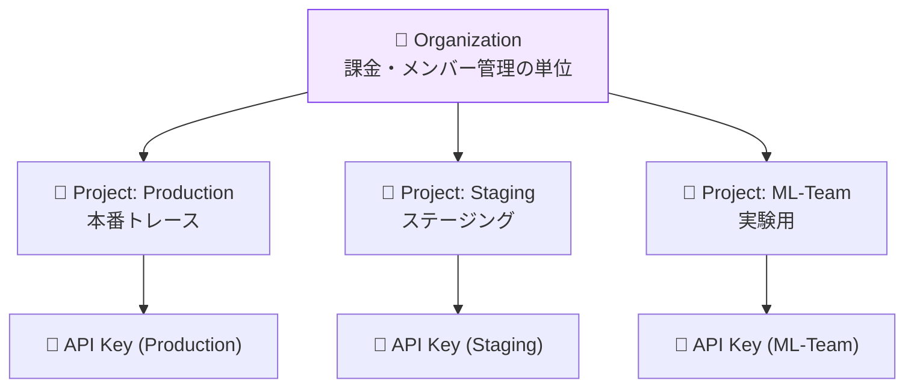

# モジュール 4-4: セキュリティとRBAC

## 学習目標

- 組織/プロジェクトの適切な設計ができる
- RBACを使った権限管理を構成できる
- APIキーのセキュアな運用ができる
- データ保持ポリシーを設計できる

---

## 1. 組織構造の設計



### 設計原則

| 原則 | 説明 |
|------|------|
| 最小権限 | 必要最小限のアクセス権のみ付与 |
| 環境分離 | 本番/開発でプロジェクトを分ける |
| APIキー分離 | 用途ごとに別キーを発行 |
| 定期ローテーション | APIキーを定期的に更新 |

---

## 2. RBAC（役割ベースアクセス制御）

### 組織レベルのロール

| ロール | 権限 |
|--------|------|
| **Owner** | 全権限（課金、メンバー管理、削除） |
| **Admin** | プロジェクト作成、メンバー招待 |
| **Member** | プロジェクトへの参加（招待制） |

### プロジェクトレベルのロール

| ロール | トレース閲覧 | スコア追加 | 設定変更 | APIキー管理 |
|--------|:-----------:|:---------:|:--------:|:-----------:|
| **Admin** | ✅ | ✅ | ✅ | ✅ |
| **Member** | ✅ | ✅ | ❌ | ❌ |
| **Viewer** | ✅ | ❌ | ❌ | ❌ |

### 推奨メンバー構成

| 役割 | 組織ロール | プロジェクトロール |
|------|-----------|-----------------|
| テックリード | Admin | Admin (全プロジェクト) |
| エンジニア | Member | Member (担当プロジェクト) |
| PdM / QA | Member | Viewer or Member |
| データサイエンティスト | Member | Member (実験プロジェクト) |

---

## 3. APIキー管理

### キーの種類と用途

| キー | 用途 | 権限 |
|------|------|------|
| Public Key (`pk-`) | トレース送信 | Write (Ingestion) |
| Secret Key (`sk-`) | 管理API | Full Access |

### セキュリティベストプラクティス

```python
# ❌ アンチパターン: コードにハードコード
langfuse = Langfuse(public_key="pk-xxx", secret_key="sk-xxx")

# ✅ 推奨: 環境変数
langfuse = Langfuse()  # LANGFUSE_PUBLIC_KEY, LANGFUSE_SECRET_KEY から取得

# ✅ 推奨: シークレット管理サービス
import boto3
secrets = boto3.client("secretsmanager")
creds = secrets.get_secret_value(SecretId="langfuse-api-keys")
```

### キーローテーション手順

1. 新しいAPIキーを発行
2. アプリケーションの環境変数を新キーに更新
3. デプロイ後、旧キーで通信がないことを確認
4. 旧キーを無効化/削除

---

## 4. データ保持とプライバシー

### データ保持ポリシー

| データ | 推奨保持期間 | 理由 |
|--------|------------|------|
| トレース本体 | 30〜90日 | 分析・デバッグ |
| メタデータ・集計 | 1年 | トレンド分析 |
| スコア | 1年 | 品質推移の追跡 |
| PII含むデータ | 最短（7〜30日） | プライバシー |

### PII（個人情報）の取り扱い

```python
import re

def sanitize_pii(text: str) -> str:
    """個人情報をマスクする"""
    text = re.sub(r'\b[\w.+-]+@[\w-]+\.[\w.-]+\b', '[EMAIL]', text)
    text = re.sub(r'\b\d{3}-\d{4}-\d{4}\b', '[PHONE]', text)
    text = re.sub(r'\b\d{4}[-\s]?\d{4}[-\s]?\d{4}[-\s]?\d{4}\b', '[CARD]', text)
    return text

@observe()
def process_with_privacy(user_input: str) -> str:
    sanitized = sanitize_pii(user_input)

    langfuse.update_current_trace(
        input={"message": sanitized},  # マスク済みを記録
        metadata={"pii_detected": sanitized != user_input},
    )

    return generate_response(user_input)  # 処理には元データを使用
```

---

## 確認問題

1. Secret KeyとPublic Keyの権限の違いは何ですか？
2. APIキーをローテーションする際のダウンタイムをゼロにする方法は？
3. PII情報をLangfuseに送信しないようにする方法は？
4. プロジェクトをチーム/環境で分ける基準は？

---

## 次のステップ

[モジュール 4-5: 外部ツール連携](./4-5-external-integrations.md) に進みましょう。
