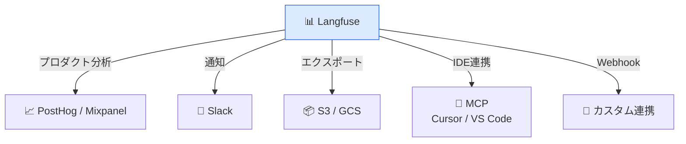

# モジュール 4-5: 外部ツール連携

## 学習目標

- PostHog/Mixpanel等のプロダクト分析ツールと連携できる
- Slack通知を設定できる
- バッチエクスポートでデータを外部に出力できる
- MCP（IDE Agent連携）を活用できる

---

## 1. 連携の全体像



---

## 2. PostHog / Mixpanel 連携

### 設定方法

UIの「Settings」→「Integrations」→「PostHog」/「Mixpanel」

### PostHog連携で得られるもの

- LLM使用イベントをPostHogのファネルで分析
- ユーザー行動とLLM品質の相関
- A/Bテスト結果の統合分析

### 連携イベント例

| LangfuseイベントP | PostHogイベント |
|------------------|----------------|
| Trace作成 | `llm_trace_created` |
| Generation完了 | `llm_generation_completed` |
| ユーザーフィードバック | `llm_feedback_submitted` |

---

## 3. Slack連携

### 通知設定

MonitorsのAlert通知先としてSlackを設定：

1. Slack AppのIncoming Webhookを取得
2. Langfuse「Settings」→「Integrations」→「Slack」にWebhook URLを設定
3. Monitorの通知先に「Slack」を選択

### 通知内容のカスタマイズ

| 通知タイプ | 内容例 |
|-----------|--------|
| コスト超過 | "⚠️ 直近1時間のコストが$50を超えました" |
| 品質低下 | "📉 relevanceスコアが0.6を下回りました" |
| エラー急増 | "🚨 エラー率が10%に達しました" |

---

## 4. バッチエクスポート

### S3へのエクスポート設定

```bash
# 環境変数設定（docker-compose.yml or .env）
LANGFUSE_S3_BATCH_EXPORT_ENABLED=true
LANGFUSE_S3_BATCH_EXPORT_BUCKET=my-analytics-bucket
LANGFUSE_S3_BATCH_EXPORT_PREFIX=langfuse-exports/
LANGFUSE_S3_BATCH_EXPORT_REGION=ap-northeast-1
LANGFUSE_S3_BATCH_EXPORT_ACCESS_KEY_ID=AKIA...
LANGFUSE_S3_BATCH_EXPORT_SECRET_ACCESS_KEY=...
```

### エクスポートデータの活用

| 活用方法 | ツール |
|---------|--------|
| BI分析 | Metabase / Superset / Tableau |
| ML学習 | Fine-tuning用データ作成 |
| 監査ログ | コンプライアンス記録 |
| バックアップ | 長期保存 |

---

## 5. MCP（Model Context Protocol）連携

### MCPとは

IDE上のAIエージェント（Cursor等）がLangfuseのデータに直接アクセスするためのプロトコル。

### 活用例

- IDEからトレースを検索・閲覧
- コーディング中にプロンプトのパフォーマンスを確認
- デバッグ時に関連トレースを即座に参照

### 設定（Cursor）

```json
{
  "mcpServers": {
    "langfuse": {
      "url": "https://cloud.langfuse.com/api/mcp",
      "headers": {
        "Authorization": "Basic <base64(pk:sk)>"
      }
    }
  }
}
```

---

## Level 4 修了チェックリスト

- [ ] 本番監視ダッシュボードを設計・構築できる
- [ ] 環境分離戦略を実装できる
- [ ] Annotation Queueでチームレビューを運用できる
- [ ] Monitors/Alertsで異常検知を設定できる
- [ ] CI/CDに品質ゲートを組み込める
- [ ] RBAC/APIキーをセキュアに管理できる
- [ ] 外部ツールとの連携を設定できる

---

## 次のレベルへ

[Level 5: プロフェッショナル](../level-5/) では、セルフホスト構築、
アーキテクチャの深い理解、Public API活用、カスタム評価パイプラインを学びます。
