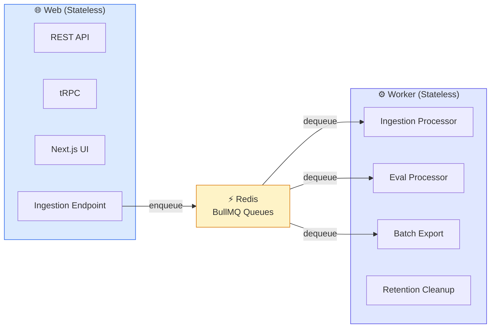
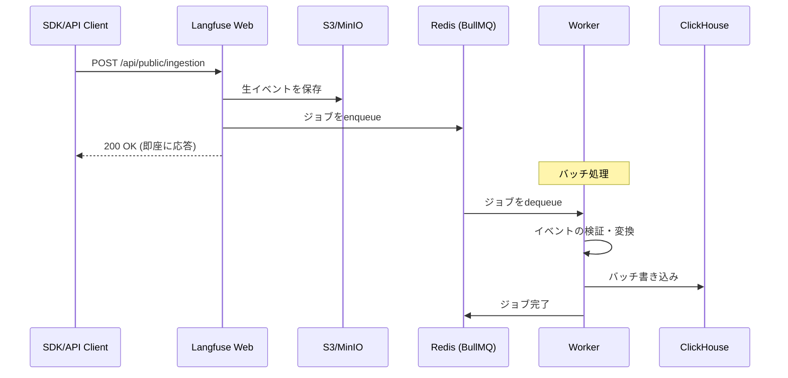
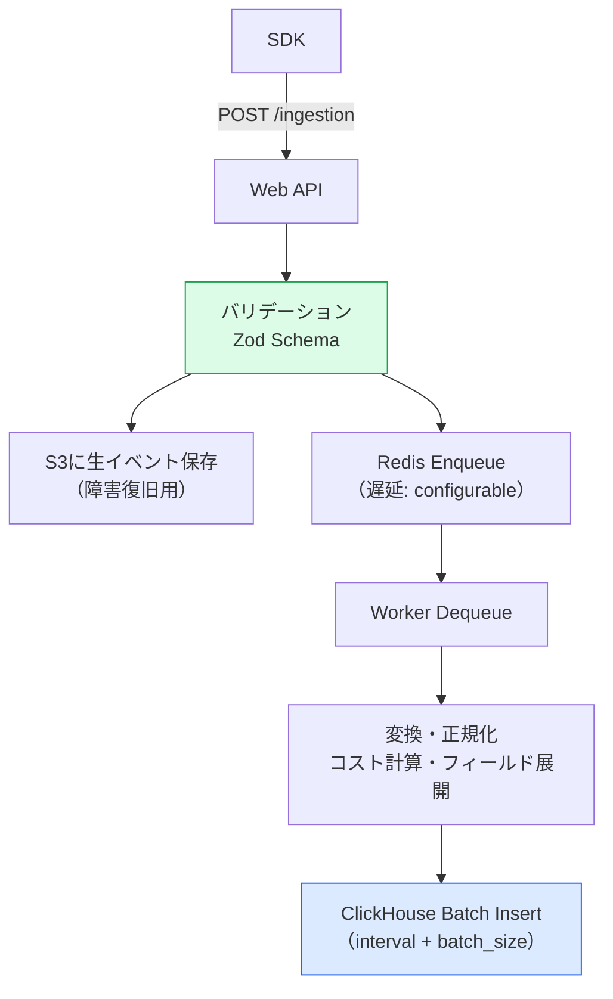
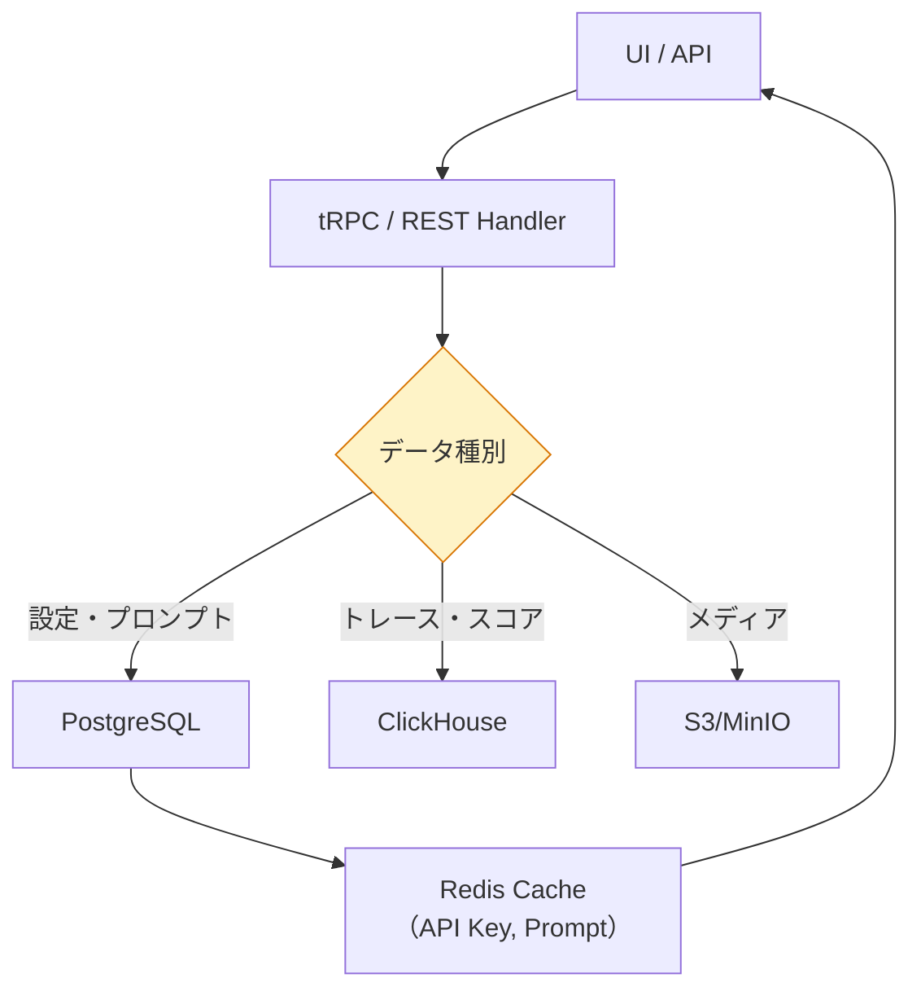

# モジュール 5-2: アーキテクチャ深掘り

## 学習目標

- Web/Worker分離の設計思想を理解する
- BullMQキューの構造と処理フローを理解する
- Ingestionパイプラインの内部動作を把握する
- ボトルネック特定とスケーリング戦略を立案できる

---

## 1. Web/Worker分離アーキテクチャ

### なぜ分離するのか

| 理由 | 説明 |
|------|------|
| 負荷分散 | API応答とバックグラウンド処理を独立スケール |
| 障害分離 | Worker障害がUIに影響しない |
| リソース最適化 | CPU集約(Worker) vs IO集約(Web)で別設定 |
| デプロイ独立性 | 片方のみ再起動可能 |



---

## 2. BullMQ キュー設計

### 主要キュー一覧

| キュー名 | 処理内容 | 優先度 |
|---------|---------|--------|
| `ingestion` | トレース/イベントの書き込み | 最高 |
| `ingestion-secondary` | 高負荷時のオーバーフロー | 高 |
| `eval-execution` | LLM-as-Judge 実行 | 中 |
| `batch-export` | S3へのバッチエクスポート | 低 |
| `retention` | データ保持期間超過の削除 | 低 |
| `monitors` | 監視ルールの評価 | 中 |
| `webhooks` | Webhook 送信 | 中 |

### Ingestion キューの処理フロー



### ジョブのリトライ設計

```
Retry Policy:
  - maxAttempts: 3
  - backoff: exponential (1s, 4s, 16s)
  - Dead Letter Queue: 失敗ジョブの保持
```

---

## 3. データフロー詳細

### 書き込みパス



### 読み取りパス



---

## 4. ClickHouse のデータモデル

### 主要テーブル

| テーブル | 内容 | パーティション |
|---------|------|--------------|
| `traces` | トレースメタデータ | 日付 + project_id |
| `observations` | Observation詳細 | 日付 + project_id |
| `scores` | スコア | 日付 + project_id |

### なぜClickHouseか

| 要件 | PostgreSQL | ClickHouse |
|------|-----------|------------|
| 大量書き込み | △ | ✅ (列指向 + バッチ) |
| 集計クエリ | △ | ✅ (超高速) |
| フィルタ+ソート | ✅ | ✅ |
| トランザクション | ✅ | ❌ (不要) |
| スキーマ変更 | ✅ | △ |

---

## 5. スケーリング戦略

### ボトルネック特定

| 症状 | 原因 | 対策 |
|------|------|------|
| API応答が遅い | Web CPU不足 | Web レプリカ増加 |
| トレースの反映遅延 | Worker処理不足 | Worker レプリカ増加 |
| ダッシュボードが遅い | ClickHouseクエリ | インデックス追加、メモリ増強 |
| Ingestion 429 | Redis キュー溢れ | Worker増加 or batch設定調整 |

### Worker の並列設定

```bash
# 環境変数でキュー別の並列数を制御
LANGFUSE_INGESTION_CLICKHOUSE_WRITE_BATCH_SIZE=500
LANGFUSE_INGESTION_CLICKHOUSE_WRITE_INTERVAL_MS=5000
LANGFUSE_EVAL_EXECUTION_WORKER_CONCURRENCY=5
```

---

## 確認問題

1. WebとWorkerを分離する設計上の理由を3つ挙げてください
2. Ingestionパイプラインで「即座に200 OKを返す」設計のメリットは？
3. ClickHouseとPostgreSQLでデータを分けている理由は？
4. トレースの反映に遅延がある場合、最初に確認すべき箇所は？

---

## 次のステップ

[モジュール 5-3: Public API活用](./5-3-public-api.md) に進みましょう。
