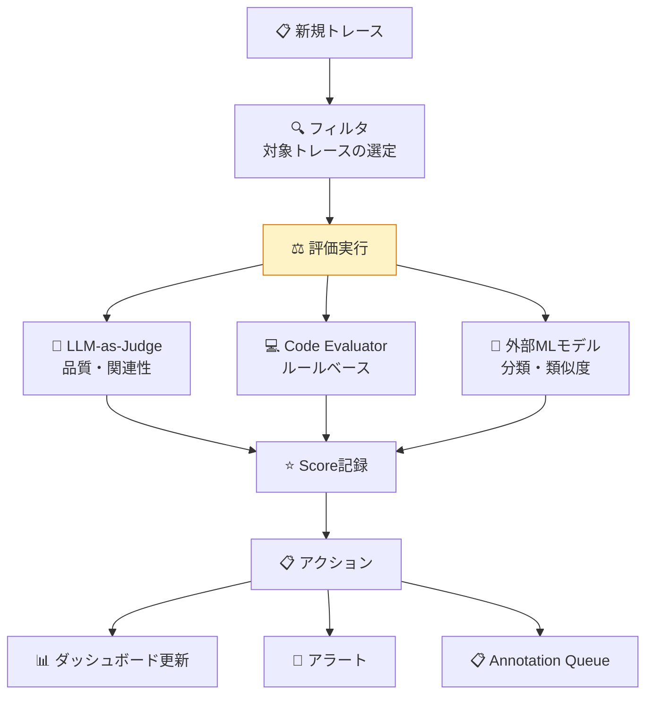
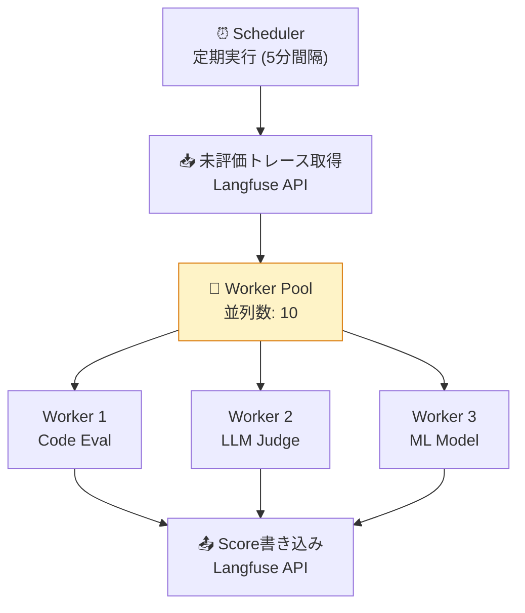

# モジュール 5-4: カスタム評価パイプライン

## 学習目標

- Code Evaluatorを開発できる
- 外部MLモデルとの連携評価を実装できる
- 大規模評価の並列実行を設計できる
- 評価パイプラインのモニタリングと改善ができる

---

## 1. 評価パイプラインの設計



---

## 2. Code Evaluator

### 概念

プログラム的なルールで評価するEvaluator。LLM不要でコストゼロ、高速、決定的。

### 実装例: JSON形式チェック

```python
import json
from langfuse import Langfuse

langfuse = Langfuse()

def evaluate_json_format(trace_id: str, output: str) -> None:
    """出力がvalid JSONかチェック"""
    try:
        parsed = json.loads(output)
        langfuse.score(
            trace_id=trace_id,
            name="json-valid",
            value=1,
            data_type="BOOLEAN",
        )

        required_fields = ["answer", "confidence"]
        has_all_fields = all(f in parsed for f in required_fields)
        langfuse.score(
            trace_id=trace_id,
            name="schema-complete",
            value=1 if has_all_fields else 0,
            data_type="BOOLEAN",
        )
    except json.JSONDecodeError:
        langfuse.score(
            trace_id=trace_id,
            name="json-valid",
            value=0,
            data_type="BOOLEAN",
            comment="Invalid JSON output",
        )
```

### 実装例: コンテンツ安全性チェック

```python
import re

BLOCKED_PATTERNS = [
    r"\b(password|secret|api.?key)\b",
    r"\b\d{4}[-\s]?\d{4}[-\s]?\d{4}[-\s]?\d{4}\b",  # クレジットカード
]

def evaluate_safety(trace_id: str, output: str) -> None:
    """出力に機密情報が含まれていないかチェック"""
    violations = []
    for pattern in BLOCKED_PATTERNS:
        if re.search(pattern, output, re.IGNORECASE):
            violations.append(pattern)

    langfuse.score(
        trace_id=trace_id,
        name="content-safety",
        value=1 if not violations else 0,
        data_type="BOOLEAN",
        comment=f"Violations: {violations}" if violations else "Clean",
    )
```

### 実装例: レイテンシ・コスト基準

```python
def evaluate_sla(trace_id: str, latency_ms: float, cost_usd: float) -> None:
    """SLA基準を満たしているかチェック"""
    # レイテンシSLA
    latency_ok = latency_ms <= 3000  # 3秒以内
    langfuse.score(
        trace_id=trace_id,
        name="latency-sla",
        value=1 if latency_ok else 0,
        data_type="BOOLEAN",
    )

    # コストSLA
    cost_ok = cost_usd <= 0.05  # 5セント以内
    langfuse.score(
        trace_id=trace_id,
        name="cost-sla",
        value=1 if cost_ok else 0,
        data_type="BOOLEAN",
    )

    # 正規化スコア
    latency_score = max(0, 1 - (latency_ms / 5000))
    langfuse.score(
        trace_id=trace_id,
        name="latency-score",
        value=round(latency_score, 3),
        data_type="NUMERIC",
    )
```

---

## 3. 外部MLモデル連携

### Embedding類似度評価

```python
import numpy as np
from openai import OpenAI

client = OpenAI()

def compute_embedding(text: str) -> list[float]:
    response = client.embeddings.create(
        model="text-embedding-3-small",
        input=text,
    )
    return response.data[0].embedding

def cosine_similarity(a: list[float], b: list[float]) -> float:
    a, b = np.array(a), np.array(b)
    return float(np.dot(a, b) / (np.linalg.norm(a) * np.linalg.norm(b)))

def evaluate_semantic_similarity(
    trace_id: str,
    output: str,
    expected_output: str,
) -> None:
    """セマンティック類似度で評価"""
    emb_output = compute_embedding(output)
    emb_expected = compute_embedding(expected_output)
    similarity = cosine_similarity(emb_output, emb_expected)

    langfuse.score(
        trace_id=trace_id,
        name="semantic-similarity",
        value=round(similarity, 4),
        data_type="NUMERIC",
        comment=f"cosine similarity with expected output",
    )
```

### 分類モデルによる評価

```python
from transformers import pipeline

toxicity_classifier = pipeline("text-classification", model="unitary/toxic-bert")

def evaluate_toxicity(trace_id: str, output: str) -> None:
    """毒性分類モデルで安全性を評価"""
    result = toxicity_classifier(output[:512])[0]

    is_toxic = result["label"] == "toxic" and result["score"] > 0.7

    langfuse.score(
        trace_id=trace_id,
        name="toxicity",
        value=0 if is_toxic else 1,
        data_type="BOOLEAN",
        comment=f"Confidence: {result['score']:.3f}",
    )

    langfuse.score(
        trace_id=trace_id,
        name="toxicity-confidence",
        value=round(1 - result["score"], 4) if result["label"] == "toxic" else round(result["score"], 4),
        data_type="NUMERIC",
    )
```

---

## 4. 大規模並列評価

### 非同期バッチ処理

```python
import asyncio
from langfuse import Langfuse

langfuse = Langfuse()

async def evaluate_trace(trace_data: dict) -> None:
    """単一トレースの全評価を実行"""
    trace_id = trace_data["id"]
    output = trace_data.get("output", {}).get("response", "")

    # 並列で複数の評価を実行
    await asyncio.gather(
        asyncio.to_thread(evaluate_json_format, trace_id, output),
        asyncio.to_thread(evaluate_safety, trace_id, output),
        asyncio.to_thread(evaluate_toxicity, trace_id, output),
    )

async def batch_evaluate(batch_size: int = 50):
    """直近のトレースをバッチ評価"""
    traces = get_unevaluated_traces(limit=batch_size)

    # セマフォで並列数を制限
    semaphore = asyncio.Semaphore(10)

    async def limited_evaluate(trace):
        async with semaphore:
            await evaluate_trace(trace)

    await asyncio.gather(*[limited_evaluate(t) for t in traces])
    langfuse.flush()
    print(f"✅ {len(traces)} traces evaluated")

# 定期実行
asyncio.run(batch_evaluate())
```

### ワーカープール設計



---

## 5. 評価パイプラインの監視

### メトリクス

| メトリクス | 監視目的 |
|-----------|---------|
| 評価完了率 | パイプラインの健全性 |
| 評価レイテンシ | ボトルネック検出 |
| Judge失敗率 | LLM API障害検知 |
| スコア分布の変動 | 評価基準のドリフト検知 |

---

## 確認問題

1. Code EvaluatorとLLM-as-Judgeの使い分け基準は？
2. Embedding類似度評価の限界は何ですか？
3. 大規模評価で並列数を制限する理由は？
4. 評価パイプラインの「ドリフト」とは何を指しますか？

---

## 次のステップ

[モジュール 5-5: エンタープライズ運用](./5-5-enterprise.md) に進みましょう。
