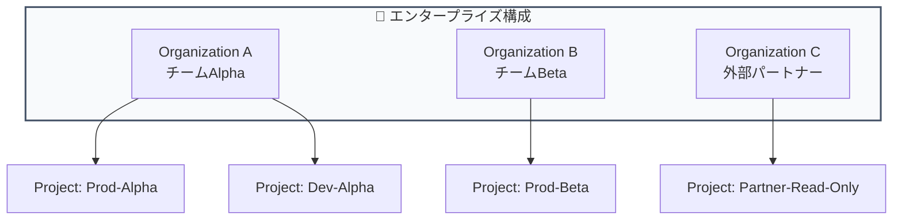
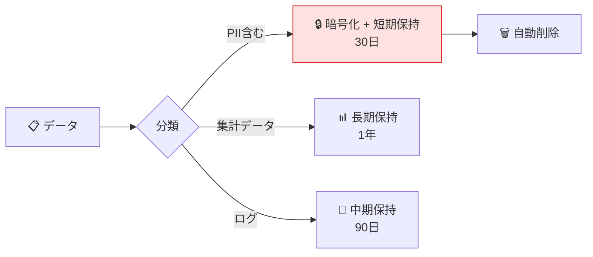
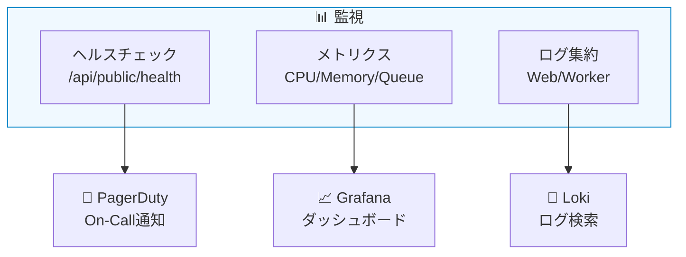

# モジュール 5-5: エンタープライズ運用

## 学習目標

- SSO/SAML認証を設定できる
- マルチテナント環境を設計できる
- 監査ログとコンプライアンス要件に対応できる
- 障害対応とDR（災害復旧）計画を策定できる

---

## 1. SSO/SAML 設定

### 対応プロバイダー

| プロバイダー | 環境変数プレフィックス |
|-------------|---------------------|
| Google | `AUTH_GOOGLE_` |
| GitHub | `AUTH_GITHUB_` |
| Azure AD | `AUTH_AZURE_AD_` |
| Okta | `AUTH_OKTA_` |
| Auth0 | `AUTH_AUTH0_` |
| Keycloak | `AUTH_KEYCLOAK_` |
| カスタムOIDC | `AUTH_CUSTOM_` |

### 設定例（Okta）

```bash
AUTH_OKTA_CLIENT_ID=0oa...
AUTH_OKTA_CLIENT_SECRET=...
AUTH_OKTA_ISSUER=https://your-org.okta.com/oauth2/default
AUTH_OKTA_ALLOW_ACCOUNT_LINKING=true
```

### セキュリティ強化

```bash
# パスワード認証の無効化（SSO必須化）
AUTH_DISABLE_USERNAME_PASSWORD=true

# 新規登録の無効化（招待制）
AUTH_DISABLE_SIGNUP=true

# 特定ドメインのみSSO強制
AUTH_DOMAINS_WITH_SSO_ENFORCEMENT=company.com,subsidiary.com

# セッション有効期間（分）
AUTH_SESSION_MAX_AGE=480  # 8時間
```

---

## 2. マルチテナント設計

### 組織構造パターン



### テナント分離の設計原則

| 原則 | 実装 |
|------|------|
| データ分離 | 組織ごとに完全なデータ分離 |
| 権限分離 | 組織間のアクセス不可 |
| コスト分離 | 組織別のUsage追跡 |
| 設定独立 | 組織ごとのLLM接続設定 |

### 初期プロビジョニング自動化

```bash
# 環境変数による自動プロビジョニング
LANGFUSE_INIT_ORG_ID=org-team-alpha
LANGFUSE_INIT_ORG_NAME="Team Alpha"
LANGFUSE_INIT_PROJECT_ID=proj-alpha-prod
LANGFUSE_INIT_PROJECT_NAME="Alpha Production"
LANGFUSE_INIT_PROJECT_PUBLIC_KEY=pk-alpha-...
LANGFUSE_INIT_PROJECT_SECRET_KEY=sk-alpha-...
LANGFUSE_INIT_USER_EMAIL=admin@alpha.company.com
LANGFUSE_INIT_USER_NAME="Alpha Admin"
LANGFUSE_INIT_USER_PASSWORD=...
```

---

## 3. 監査とコンプライアンス

### 監査ログの取得ポイント

| イベント | 記録内容 |
|---------|---------|
| ログイン/ログアウト | ユーザー、IP、時刻 |
| APIキー作成/削除 | 操作者、キーID |
| プロンプト変更 | 変更者、差分、バージョン |
| メンバー追加/削除 | 操作者、対象者、ロール |
| データ削除 | 操作者、対象、理由 |

### データ保持とGDPR対応



### GDPR準拠チェックリスト

- [ ] データ処理の法的根拠を明確化
- [ ] データ保持期間の設定と自動削除
- [ ] データ主体のアクセス権/削除権の対応手順
- [ ] PII のマスキング/暗号化
- [ ] 第三者委託先（LLM API）のデータ処理契約

---

## 4. 障害対応

### 監視体制



### 障害パターンと対応

| 障害 | 影響 | 初動対応 |
|------|------|---------|
| Web停止 | UI/APIアクセス不可 | レプリカ確認、再起動 |
| Worker停止 | トレース反映遅延 | キュー確認、再起動 |
| PostgreSQL障害 | 全機能停止 | フェイルオーバー |
| ClickHouse障害 | 分析機能停止 | 書き込みはS3にバッファ |
| Redis障害 | キュー停止 | Sentinel自動フェイルオーバー |

### DR（災害復旧）計画

```bash
# RPO (Recovery Point Objective): 最大1時間のデータロス許容
# RTO (Recovery Time Objective): 30分以内の復旧

# バックアップスケジュール
# - PostgreSQL: 1時間ごとのWAL + 日次フルバックアップ
# - ClickHouse: 日次バックアップ
# - S3/MinIO: クロスリージョンレプリケーション
# - Redis: AOF永続化 + 定期RDB
```

---

## 5. パフォーマンスチューニング

### ClickHouse最適化

```sql
-- インデックス最適化
ALTER TABLE traces ADD INDEX idx_project_time (project_id, timestamp)
  TYPE minmax GRANULARITY 4;

-- マテリアライズドビュー（集計の高速化）
CREATE MATERIALIZED VIEW daily_stats
ENGINE = SummingMergeTree()
ORDER BY (project_id, date)
AS SELECT
    project_id,
    toDate(timestamp) as date,
    count() as trace_count,
    sum(total_cost) as total_cost
FROM traces
GROUP BY project_id, date;
```

### Worker チューニング

```bash
# Ingestionバッチ設定
LANGFUSE_INGESTION_CLICKHOUSE_WRITE_BATCH_SIZE=1000
LANGFUSE_INGESTION_CLICKHOUSE_WRITE_INTERVAL_MS=3000

# 並列度
LANGFUSE_EVAL_EXECUTION_WORKER_CONCURRENCY=10
LANGFUSE_LLM_AS_JUDGE_EXECUTION_WORKER_CONCURRENCY=5
```

---

## Level 5 修了チェックリスト

- [ ] Docker Compose / Helm でセルフホスト環境を構築できる
- [ ] Web/Worker/データストアの役割と関係を説明できる
- [ ] Public REST APIでカスタムツールを構築できる
- [ ] Code Evaluator / 外部MLモデル連携の評価パイプラインを実装できる
- [ ] SSO設定、RBAC、監査ログの運用ができる
- [ ] 障害対応手順とDR計画を策定できる

---

## 全レベル修了

おめでとうございます！全5レベルのトレーニングを修了しました。

これであなたは以下ができるようになりました：
- Langfuseの全機能を理解し活用できる
- チームでのLLMOps運用を設計・実装できる
- セルフホスト環境を構築・運用できる
- カスタム評価パイプラインでLLM品質を管理できる
- エンタープライズ要件に対応できる
